# Xdebug 如何帮助你成为更好的 WordPress 开发者

> 原文：<https://kinsta.com/blog/xdebug/>

任何开发人员都可以证明，在第一份草稿之后，代码永远不会准备好投入生产。开发过程的一个关键部分是调试——删除或更改所有无效的代码部分。

PHP 的 Xdebug 扩展是根除和消除代码中所有 bug 的一种流行方法。

Xdebug 的一个优点是它非常灵活。不管您喜欢什么样的框架或开发环境，您都可以找到适合您工作流程的 Xdebug 版本。从那里开始，使用这个工具不会花很长时间。

本教程将深入研究 Xdebug，包括安装过程、将其集成到您的设置中以及一般用法。

首先，让我们给你更多的关于 Xdebug 是什么和它做什么的上下文。

## Xdebug 简介

Xdebug 是调试 PHP 代码最流行的扩展之一。您将从您选择的环境中安装它，它充当“单步调试程序”


The Xdebug logo.


简而言之，这使您能够逐行处理您的代码，这样您就可以单步执行并查看代码在程序中是如何操作和交互的，以及调查它的输出。在那里，你可以做你认为合适的改变。


> Kinsta 把我宠坏了，所以我现在要求每个供应商都提供这样的服务。我们还试图通过我们的 SaaS 工具支持达到这一水平。
> 
> <footer class="wp-block-kinsta-client-quote__footer">
> 
> 
> 
> <cite class="wp-block-kinsta-client-quote__cite">Suganthan Mohanadasan from @Suganthanmn</cite></footer>

[View plans](https://kinsta.com/plans/)

 不过，Xdebug 可以做得更多:

*   您可以使用一组度量和可视化来分析代码的[性能。](https://kinsta.com/blog/application-performance-monitoring/)
*   当您运行 PHP 单元测试时，您可以看到您运行和执行了哪些代码套件。
*   Xdebug 包含“跟踪”功能，可以将每个函数调用写入磁盘。这将包括参数、变量赋值和返回值。
*   Xdebug 还对标准的 PHP 错误报告进行了改进。稍后我们将对此进行更多的讨论。

给定特性集，有很多方法可以在工作流中使用 Xdebug(以及任何类似的调试器)。我们将在下一节讨论这些。

[Debugging is a key part of the development process- and Xebug is here to make that process easier 💪Click to Tweet](https://twitter.com/intent/tweet?url=https%3A%2F%2Fbit.ly%2F3ywXKYl&via=kinsta&text=Debugging+is+a+key+part+of+the+development+process-+and+Xebug+is+here+to+make+that+process+easier+%F0%9F%92%AA&hashtags=WebDev%2CDevelopment)

## 为什么要使用 Xdebug

许多开发人员没有使用第三方工具和扩展的专用调试工作流。这是因为 PHP 包含了自己的基本错误日志。您将使用诸如`error_log`、`var_dump`和 print 这样的命令来查看变量和函数调用的结果。

例如，你可以为 WordPress 开发重新利用许多代码片段— [栈溢出充斥着它们](https://stackoverflow.com/questions/15085482/wordpress-debugging):

```
function log_me($message) {
  if ( WP_DEBUG === true ) {
      if ( is_array($message) || is_object($message) ) {
          error_log( print_r($message, true) );
      } else {
           error_log( $message );
      }
  }
}
```

然而，这种方法有一些重要的缺点:

*   您首先必须确保为您正在使用的平台启用了错误日志。在这种情况下，您将需要启用`WP_DEBUG`(稍后将详细介绍)。
*   这个“转储”调试的例子提供的调查范围比单步调试小。在这里，您只能输出您定义的任何内容。

后一点需要大量的手工劳动，尤其是如果你的日常工作不是作为系统管理员。例如，如果要调试代码块，可以根据您定义的变量添加代码段。然而，它可能不是问题的根源，甚至不能说明发生了什么。

相反，Xdebug 这样的工具可以发挥其魔力，提供更大的范围:

*   您可以在执行过程中的不同点“中断”您的代码，以实时查看发生了什么。
*   有无数的度量、可视化、分支等等来帮助你确定你的代码在做什么以及它如何响应。
*   有时，您甚至可以在调试过程中动态地更改值。这提供了巨大的价值，甚至对于运行良好的代码套件也是如此。实际上，您可以在任何时候执行手动单元测试。
*   因为您使用断点来标记要调试的区域，所以不需要在代码中使用代码片段。这使您的代码更整洁，并减少未来问题的数量。

总的来说，使用 Xdebug 这样的工具是一个主动的决定，而不是被动的。您可以将分步调试作为核心开发过程的一部分，就像将单元测试作为测试驱动开发(TDD)的一部分来实现一样。

## 如何打开 PHP 错误日志

虽然您可以在没有特定错误的情况下调试您的代码，但是在没有打开 Xdebug 的情况下知道是否出现了问题通常是很好的。这给了你一个[探索](https://kinsta.com/blog/debugging-wordpress-performance/)的起点。这不是绝对必要的，但可以是你的链中有帮助的一部分。

为了报告出现的每个错误，您需要在相关 PHP 文件的顶部添加一行:

```
error_reporting(E_ALL);
```

这是一个无所不包的命令，您可以使用`[ini_set](https://www.php.net/manual/en/function.ini-set.php)`功能实现同样的功能:

```
ini_set('error_reporting', E_ALL);
```

这允许您逐个项目地更改您的 **php.ini** 文件中的设置。虽然您可以进入该文件并进行手动更改，但使用`ini_set`来更改特定参数通常是一个更好的主意:

```
ini_set('display_errors', '1');
```

一旦根据自己的喜好设置了活动错误报告，就可以开始使用 Xdebug 了。

## 如何使用 Xdebug

在接下来的几节中，我们将向您展示如何使用 Xdebug，包括设置所需的步骤。虽然我们无法涵盖工具的每个方面，但本快速入门指南将帮助您快速入门。

不过，首先，您需要安装 Xdebug。让我们找出如何做它。

### 1.为您的操作系统安装 Xdebug

因为 Xdebug 适用于任何数量的设置，所以每个设置的[确切过程](https://xdebug.org/docs/install)会略有不同。在操作系统级别，有一些不同之处:

*   Windows: 这是一个有点复杂的安装过程，包括使用一个现有的 PHP 文件和一个[安装向导](https://xdebug.org/wizard)，然后为你的系统下载正确的版本。
*   **Linux:** 这里的方法可以说是最直接的:你可以使用一个[包管理器](https://xdebug.org/docs/install#linux)来安装 Xdebug，或者 [PHP 扩展社区库(PECL)](https://xdebug.org/docs/install#pecl) 。
*   **Mac:** 这个方法也很简单:一旦安装了 PECL，就可以从终端实例运行`pecl install xdebug`。您还需要在系统上安装 XCode 命令行工具和 PHP。

然而，大多数用户不想坚持使用 Xdebug 的系统级实例。相反，您会希望将其集成到您自己的开发环境中。

### 2.将 Xdebug 集成到您的开发环境中

一旦你为你的操作系统安装了 Xdebug，你就应该把它连接到你的环境中。

这里支持的系统和工具如此之多，我们无法一一列举。稍后，我们将为您提供关于 [DevKinsta](https://kinsta.com/devkinsta/) 和 [PhpStorm](https://www.jetbrains.com/phpstorm/) 的说明。即便如此，还有许多其他流行的环境可供选择。以下是我们的一些主要建议。

#### 变化不定的流浪者(VVV)

[VVV](http://varyingvagrantvagrants.org/) 是 [Make WordPress 网站](https://make.wordpress.org/core/handbook/tutorials/installing-a-local-server/installing-vvv/)上命名的环境之一:

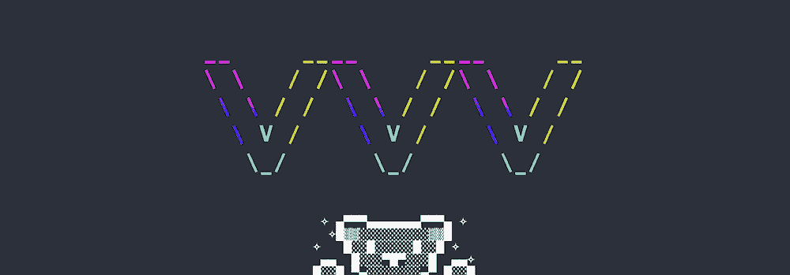

The Varying Vagrant Vagrants logo.


好消息是 VVV 已经包含了 Xdebug 的[版本，但是你需要激活它。您可以在终端窗口中使用安全外壳(SSH)来实现这一点:](https://varyingvagrantvagrants.org/docs/en-US/references/xdebug/)

```
vagrant ssh -c "switch_php_debugmod xdebug"
```

不过，性能会受到一点影响，如果您设置了您的站点，您需要重新打开这个选项。

#### 拉那的选举

对于一些用户来说， [Laravel 的 Valet](https://laravel.com/docs/9.x/valet) 代表了一个近乎完美的 web 开发环境。更好的是，您可以将 Xdebug 与它集成。

为此，您需要为调试器创建一个配置文件。您可以在命令行使用`php --ini`找到自己的路径，这将返回几个不同的文件路径:

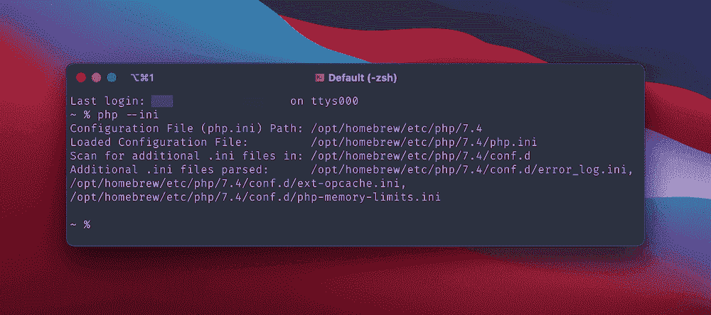

The Terminal showing a list of configuration file paths.


接下来，在附加**的路径下创建一个新的 **xdebug.ini** 文件。ini** 文件。在我们的例子中，它位于**/opt/home brew/etc/PHP/7.4/conf . d**。

打开这个新文件后，还要打开加载的配置文件的路径(您的主 **php.ini** 文件)。在两者都打开的情况下，在底部添加以下内容:

*   **PHP . ini:**t0]
*   **xdebug.ini:** `xdebug.mode=debug`

一旦你保存了你的更改，从终端运行`valet restart`，然后将`phpinfo(); exit;`添加到你站点的一个文件中。您将希望通过浏览器中的快速页面加载来检查这是否有效。

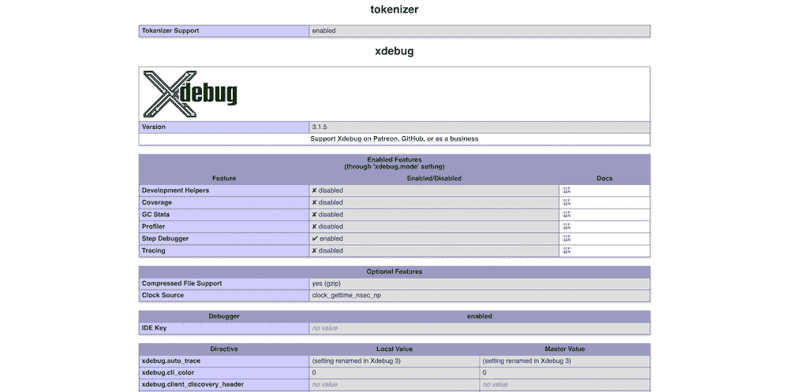

The PHP information screen.


请注意，您可能需要使用`sudo brew services restart php`重启 PHP，并使用`php --info | grep xdebug`检查 Xdebug 的系统安装是否正确。您会注意到输出中特定于 Xdebug 的行:


从这里开始，您可以将 Xdebug 集成到您选择的编码编辑器中。

#### XAMPP

就像贴身男仆一样， [XAMPP](https://www.apachefriends.org/download.html) 的流程也有几个部分。但是 Windows 和 macOS 版本有两个不同的流程。

首先安装 XAMPP，然后快速检查一下你的系统上是否有 **php_xdebug.dll** 文件(Windows)或 **xdebug.so** 文件(macOS ):

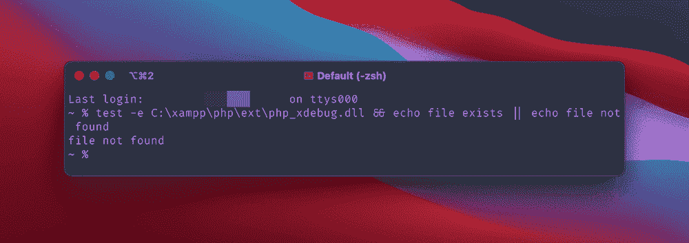

A Terminal window showing a test for a XAMPP file.


如果文件存在，您可以继续进行配置。否则，你首先需要[下载适合 Windows 的二进制文件](https://xdebug.org/download)——一个适合你的首选 PHP 版本的 64 位文件——或者如果你在 Mac 上安装更多的依赖项。

对于 Windows，重命名 DLL 文件 **php_xdebug.dll** ，然后将其移动到 **\xampp\php\ext** 文件路径。接下来，在您的[首选代码编辑器](https://kinsta.com/blog/best-text-editors/)中打开 **\xampp\php\php.ini** 文件，并添加以下内容:

```
output_buffering = Off
```

在`[XDebug]`部分，添加以下三行:

```
zend_extension=xdebug
xdebug.mode=debug
xdebug.start_with_request=trigger
```

保存更改后，重启 Apache 并测试 Xdebug。

[对于 Mac](https://stevegeorge.net/2022/02/11/installing-xdebug-for-xampp-on-mac/) ，你需要确保在终端实例中使用`xcode-select --install`安装 [Xcode](https://developer.apple.com/xcode/) 命令行工具。在那之后，有三个你想用自制软件安装的包:

```
brew install autoconf automake libtool
```

在某些情况下，你还需要重新安装 XAMPP 来获得核心程序和“开发者文件”您应该可以只重新安装这些文件，但是您需要先备份现有的安装。

接下来，导航到系统上 Xdebug 源文件的下载文件夹，并解压缩 TGZ 文件。在终端窗口中，导航到该目录并运行以下命令:

```
phpize
pecl install xdebug
```

请注意，您可能也需要在这里使用`sudo`。从这里，您可以编辑 XAMPP php.ini 文件。对于大多数 macOS 安装，你可以在**/Applications/XAMPP/xamppfiles/etc/PHP . ini**找到它。在这个目录中，您还会找到您的 **xdebug.so** 文件的路径——记下它并使用它来代替这个代码片段的文件路径占位符:

## 注册订阅时事通讯


### 想知道我们是怎么让流量增长超过 1000%的吗？

加入 20，000 多名获得我们每周时事通讯和内部消息的人的行列吧！

[Subscribe Now](#newsletter)

```
[xdebug]
zend_extension=/path/to/xdebug.so
xdebug.mode=develop,degug
xdebug.start_with_request=yes
```

为了测试这是否有效，在主 **htdocs** XAMPP 目录中创建一个新的 **xdebug_info.php** 文件。在内部，添加以下内容:

```
<?php
xdebug_info();
```

…然后刷新 Apache 并在浏览器中测试 Xdebug。

## 使用 PhpStorm 和 Xdebug

一旦通过操作系统和开发环境安装了 Xdebug，您还需要查看调试器本身。您将通过您选择的代码编辑器或[集成开发环境(IDE)](https://kinsta.com/blog/php-editor/) 来完成这项工作。与您的环境一样，有许多可供选择的环境，并且每个环境都可能有不同的方法。

 也就是说，许多开发人员选择使用 [JetBrains 的 PhpStorm](https://www.jetbrains.com/phpstorm/) 。事实上，PhpStorm 提供了[“WordPress 感知协助”](https://www.jetbrains.com/help/phpstorm/preparing-to-use-wordpress.html)——而且由于许多其他原因，它也是一个受欢迎的选择。

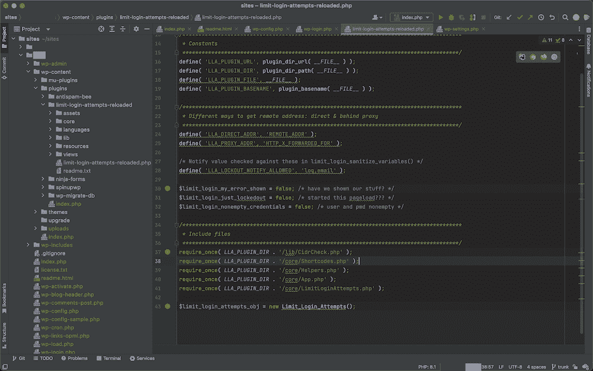

The PhpStorm interface.


JetBrains 网站包含了关于连接 Xdebug 和 PhpStorm 的完整说明，但是我们将在这里回顾它们。

首先，在**首选项**窗格中导航到**语言&框架> PHP** 页面。在这里，打开 **CLI 解释器**下拉字段旁边的**更多项目**烤肉串菜单:

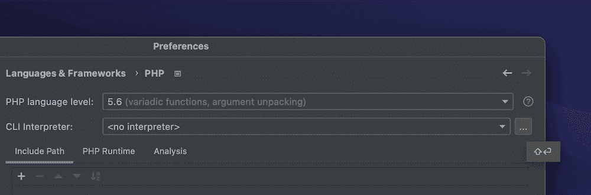

Selecting a CLI interpreter in PhpStorm.


这将显示关于您的 PHP 版本和解释器的更多细节。如果您点击**配置文件**选项旁边的**更多项目**省略号，您将看到您的 **php.ini** 文件的完整路径:

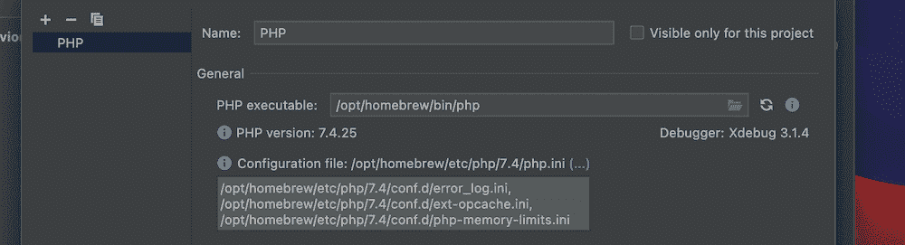

Amending the PHP configuration within PhpStorm.


接下来您将使用这个 PHP 文件继续安装过程。

#### 在 php.ini 文件中工作

这里的第一个任务是编辑掉任何影响 Xdebug 如何使用 PhpStorm 的行。

在 **php.ini** 文件中，查找下列行，或者删除它们，或者注释掉它们:

```
zend_extension=<path_to_zend_debugger>
zend_extension=<path_to_zend_optimizer>
```

这些线不会在所有情况下都出现，所以如果你没有看到它们，不要惊慌。

接下来，将以下内容添加到文件中:

```
[xdebug]
zend_extension="xdebug.so"
xdebug.mode=debug
xdebug.client_host=127.0.0.1
xdebug.client_port="<the port (9003 by default) to which Xdebug connects>"
```

关于这套代码，有几点需要注意:

*   您可能已经有一个`[xdebug]`部分，在这种情况下，您可以省略第一个指定。
*   `zend_extension`条目可能需要你添加 **xdebug.so** 的完整路径来连接。
*   虽然看起来像一个占位符，但是`xdebug.client_port`参数是您在代码中设置它的方式。

一旦添加了这些，保存并关闭文件，然后从命令行测试 PHP 版本(使用`php --version`):


Testing for the current installations for PHP and Xdebug using the macOS Terminal.


如果您有 Xdebug 的工作版本，它将显示为 PHP 扩展之一。您也可以将`phpinfo();`添加到一个新文件中，并在浏览器中进行测试。

Struggling with downtime and WordPress problems? Kinsta is the hosting solution designed to save you time! [Check out our features](https://kinsta.com/features/)

这是让 Xdebug 作为 PhpStorm 的默认调试器所需要做的全部工作。使用它之前的最后一步是安装浏览器助手扩展。

#### 安装浏览器助手扩展

您需要建立的最后一个关键连接是浏览器和 PhpStorm 之间的连接，通过在服务器上激活 step 调试来完成。虽然您可以从命令行使用特殊的`GET`或`POST`值来实现这个[，但是使用扩展更简单。](http://xdebug.org/docs/step_debug#starting)

我们建议使用专用的 Xdebug Helper 扩展。您可以将它安装在您选择的浏览器上:

*   [Chrome/Chromium/Brave 的 Xdebug 助手](https://chrome.google.com/webstore/detail/xdebug-helper/eadndfjplgieldjbigjakmdgkmoaaaoc)
*   火狐的 Xdebug 助手
*   [Safari 的 Xdebug 助手](https://apps.apple.com/app/safari-xdebug-toggle/id1437227804?mt=12)

如果你想探索其他扩展， [JetBrains 网站](https://www.jetbrains.com/help/phpstorm/browser-debugging-extensions.html)为最流行的浏览器提供了一些额外的选项。

一旦你安装了你选择的浏览器扩展，你不应该再调整任何进一步的配置设置。从这里，您可以开始将 Xdebug 与 PhpStorm 一起使用。

### 使用 Xdebug

虽然我们将在这里使用 PhpStorm，但是您将会看到不同 ide 之间相似的布局和接口——尽管也会有一些明显的差异。

有几个概念结合在一起形成了整个调试体验:

*   **断点:**这些是 Xdebug 将停止的点，以便让您检查输出。您可以根据自己的喜好设置任意多的选项。
*   **监听连接:**你可以打开或关闭它，尽管大多数开发人员总是让它开着。
*   **调试屏幕:**您的大部分时间将花在调试界面上——在这里您将处理各行代码、变量和参数。

第一步是激活监听——没有它你将无法调试任何东西。为此，点击工具栏中的**运行>开始监听 PHP 调试连接**选项:

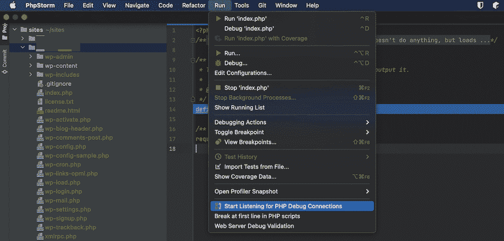

The open Run menu within PhpStorm.


或者，您可以单击 PhpStorm 工具栏中的“电话”图标:

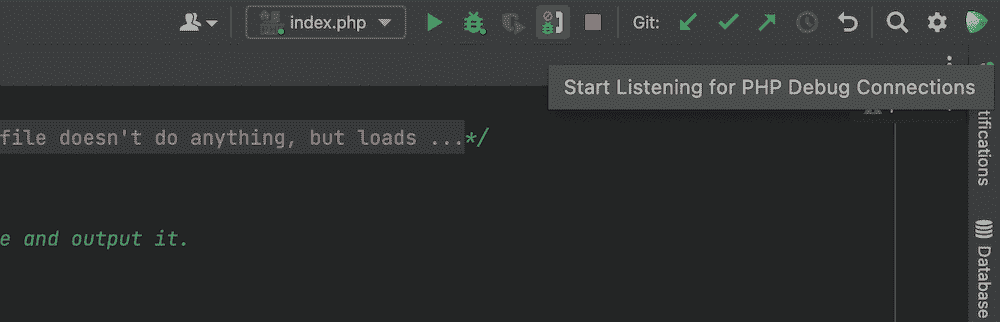

Listening for PHP debug connections using the telephone icon within the PhpStorm toolbar.


这两个选项都将开始监听连接。

从这里，您可以开始在代码编辑器的槽中设置断点。红点表示断点，您可以单击它来激活断点:

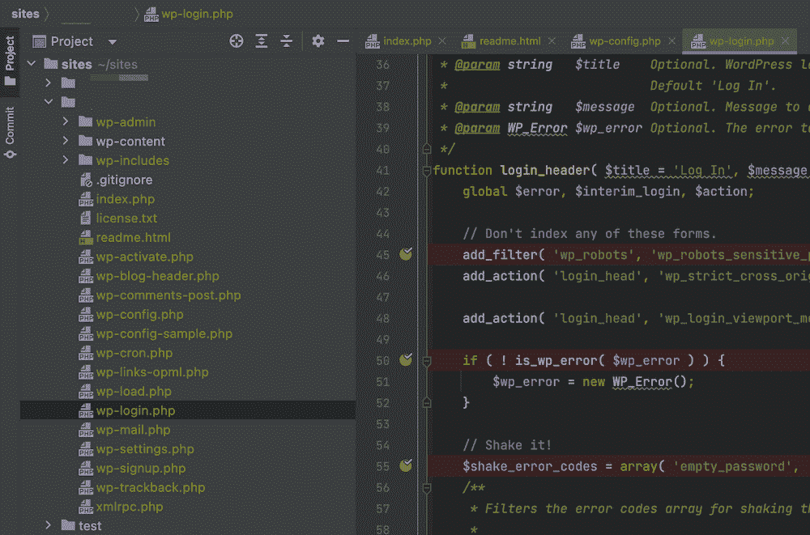

Breakpoints within the gutter of a PhpStorm editing page.


当您想调试代码时，最直接的方法是开始监听，设置断点，然后在浏览器中进入特定页面。在浏览器中找到您的扩展的图标，然后单击它并选择“调试”选项:

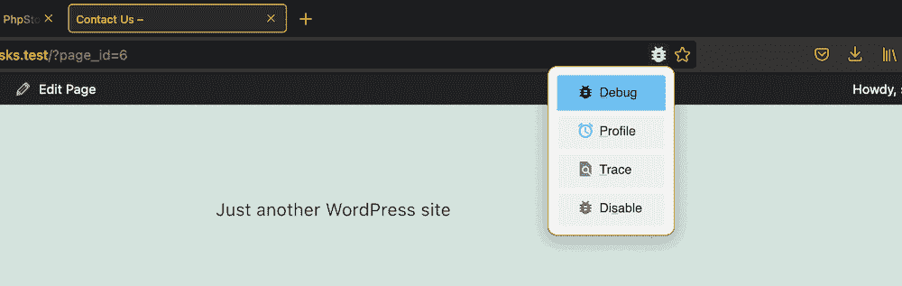

Selecting the Debug option within the browser toolbar using a dedicated extension.


这将在 PhpStorm 中打开调试器，并传递好消息或坏消息:

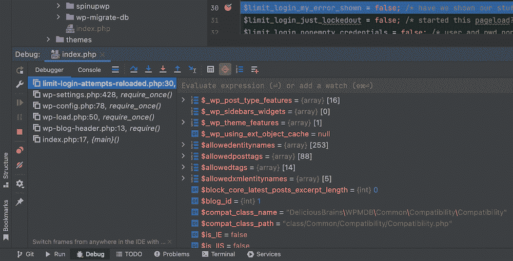

Using the PhpStorm debugger with Xdebug.


如果您右键单击各种值、属性、参数和变量，您将能够访问进一步的上下文菜单。这为您测试和调试代码提供了大量额外的空间:


Using the right-click context menu within the PhpStorm Debugger to set new values.


例如，您可以沿路径为变量设置不同的值。这可能是故意破坏您的代码，看看会发生什么，或者这可能是一种测试已经需要修复的代码的方法。无论哪种方式，这都为您提供了一个调试代码的绝佳方法，而无需先修改代码。

## Kinsta 如何帮助你调试你的 WordPress 网站

WordPress 自带[组调试选项](https://kinsta.com/help/wordpress-debugging/)到`WP_DEBUG`和其他工具[，比如查询监视器](https://kinsta.com/blog/query-monitor/)。这些启用了一种模式，在这种模式下，您将开始看到以前隐藏的错误消息遍布您的站点和仪表板。从那里，你可以开始找出问题是什么。

您还可以使用`WP_DEBUG_LOG`保存这些错误消息，这为您提供了一种记录站点问题的方法。我们将在博客的另一篇文章[中介绍如何设置。通过你的](https://kinsta.com/blog/wordpress-debug/) [MyKinsta 仪表板](https://my.kinsta.com/)(以及**站点>工具**屏幕)，这是一件轻而易举的事情:

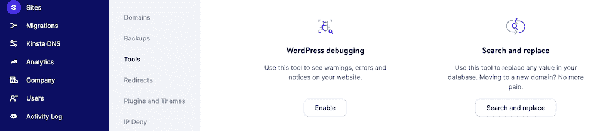

The WordPress debugging option within the MyKinsta dashboard.


如果你将它与[免费的 DevKinsta 本地环境工具](https://kinsta.com/devkinsta/features/)配合使用，你还可以通过[为你启动的每个站点启用和禁用](https://kinsta.com/knowledgebase/devkinsta/logging/) `WP_DEBUG`:

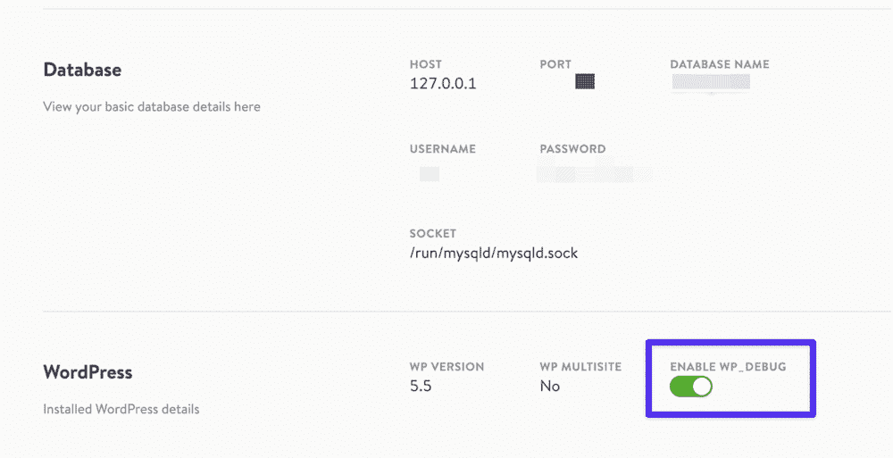

Enabling WP_DEBUG within DevKinsta’s control panel.


这意味着您可以在开发过程中发现站点上的错误，并确保它们不会影响到您的实时站点。这些模式也很容易关闭——这对[网站和用户安全](https://kinsta.com/blog/wordpress-security-plugins/)都至关重要。

所有的 Kinsta 计划还带有内置的 [Kinsta APM 工具](https://kinsta.com/apm-tool/)，这是我们为 WordPress 网站定制的性能监控工具。


## 命令备忘单

在我们结束这篇文章之前，我们应该提到捷径。

像许多其他软件一样，有多种方法可以单独使用键盘在 Xdebug(和 PhpStorm)中导航。事实上，您甚至可以使用命令行来调试 PHP 脚本。

一旦 Xdebug 启动并运行，您可以使用以下命令来解决问题:

| 命令 | 捷径 |
| --- | --- |
| 指定监听的端口(如`[9003]`) | `-p [value]` |
| 在给定文件路径的指定行上设置断点。 | `breakpoint_set -t line file:///<path> -n <line>` |
| 运行脚本，直到结束或下一个断点 | `run` |
| 进入下一个可执行行 | `step_into` |
| 列出当前范围内的变量和值 | `context_get` |
| 显示指定属性的值 | `property_get -n <property>` |

虽然您的特定代码编辑器有自己专用的快捷键，但这里的重点是 PhpStorm。看一下这个表，它列出了使用 Xdebug 和 PhpStorm 的键盘快捷键:

| 命令 | Windows 操作系统 | 马科斯 |
| --- | --- | --- |
| 寻找行动 | **Ctrl**+**Shift**+**A** | **换挡** + **Cmd** + **A** |
| 打开调试器 | **换挡** + **F9** | **Ctrl** + **D** |
| 切换断点 | **控制** + **F8** | **Cmd** + **F8** |
| 进入 | **F7** | **F7** |
| 跨过 | **F8** | **F8** |
| 查看断点 | **Ctrl**+**Shift**+**F8** | **换挡** + **Cmd** + **F8** |
| 恢复程序 | **F9** | **F9** |
| 评估当前表达式 | **Alt** + **F8** | **选项** + **F8** |

谢天谢地，这里没有太多需要记忆的东西。您必须打开调试器，设置每行的断点，侦听连接，并运行您的脚本。

但是，如果您需要一个特定任务的快捷方式，您可以使用 PhpStorm **Find Action** 命令:

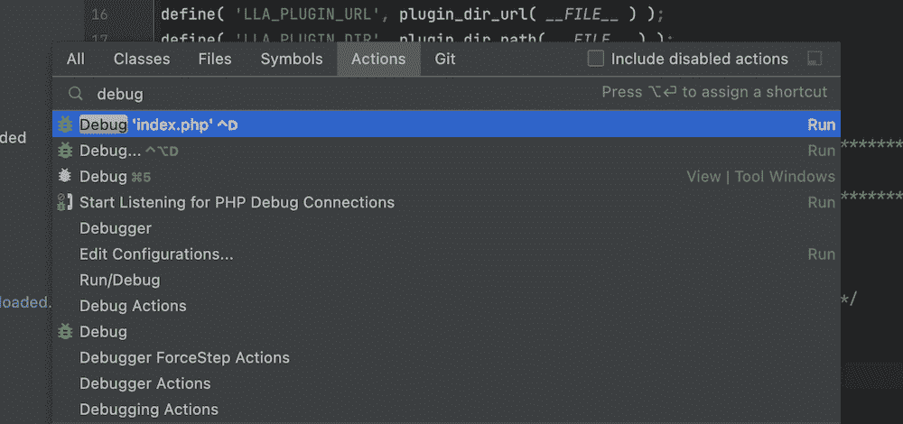

Using the Find Action menu within PhpStorm.


一旦你开始在这里输入，你会看到一个命令和相关快捷键的动态列表。你也可以通过**帮助>键盘快捷键 PDF** 菜单找到所有键盘快捷键的 PDF 版本。

如果你想在使用鼠标时更多地实时查看快捷键，JetBrains 提供了[按键加速器 X](https://plugins.jetbrains.com/plugin/9792-key-promoter-x) 插件:

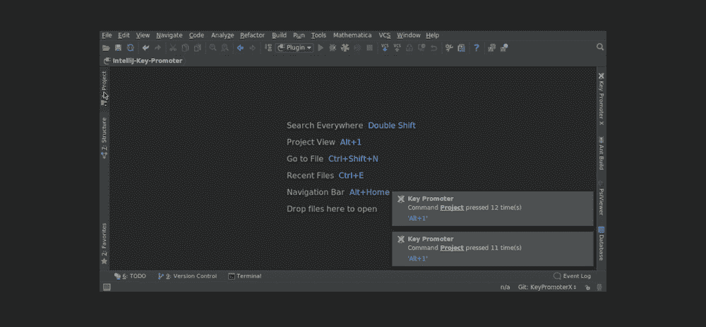

The PhpStorm interface showing Key Promoter X notifications.


这个方便的工具将显示你最近执行的动作的通知，以及相关的键盘快捷键。一旦你学会并使用快捷方式，你可以逐步淘汰这个插件，并恢复你的屏幕上有价值的不动产。

[As any developer can attest, code is never ready for production after the first draft. Debugging is key- which is where Xdebug comes in 🐛Click to Tweet](https://twitter.com/intent/tweet?url=https%3A%2F%2Fbit.ly%2F3ywXKYl&via=kinsta&text=As+any+developer+can+attest%2C+code+is+never+ready+for+production+after+the+first+draft.+Debugging+is+key-+which+is+where+Xdebug+comes+in+%F0%9F%90%9B&hashtags=WebDev%2CDevelopment) ## 摘要

调试实践已经从它卑微的开端走了很长的路；它现在包含的范围比它的祖先可能想象的要广得多。要彻底修复 PHP 代码，你需要使用一个有能力的工具。有许多优秀的扩展和工具可供选择，但 [Xdebug](https://xdebug.org/) 是一个有争议的领先者。

正如我们所看到的，Xdebug 甚至可以适应代码编辑器中最折衷的口味，当它与 [PhpStorm](https://www.jetbrains.com/phpstorm/) 配合使用时尤其出色。然而，不管您的设置如何，通常都会有一个 Xdebug 版本来满足您的需求。总的来说，这是一个强大、灵活、直观的工具。

你觉得 Xdebug 配得上它的高赞吗，还是有你更喜欢的其他调试工具？请在下面的评论区告诉我们！

* * *

让你所有的[应用程序](https://kinsta.com/application-hosting/)、[数据库](https://kinsta.com/database-hosting/)和 [WordPress 网站](https://kinsta.com/wordpress-hosting/)在线并在一个屋檐下。我们功能丰富的高性能云平台包括:

*   在 MyKinsta 仪表盘中轻松设置和管理
*   24/7 专家支持
*   最好的谷歌云平台硬件和网络，由 Kubernetes 提供最大的可扩展性
*   面向速度和安全性的企业级 Cloudflare 集成
*   全球受众覆盖全球多达 35 个数据中心和 275 多个 pop

在第一个月使用托管的[应用程序或托管](https://kinsta.com/application-hosting/)的[数据库，您可以享受 20 美元的优惠，亲自测试一下。探索我们的](https://kinsta.com/database-hosting/)[计划](https://kinsta.com/plans/)或[与销售人员交谈](https://kinsta.com/contact-us/)以找到最适合您的方式。