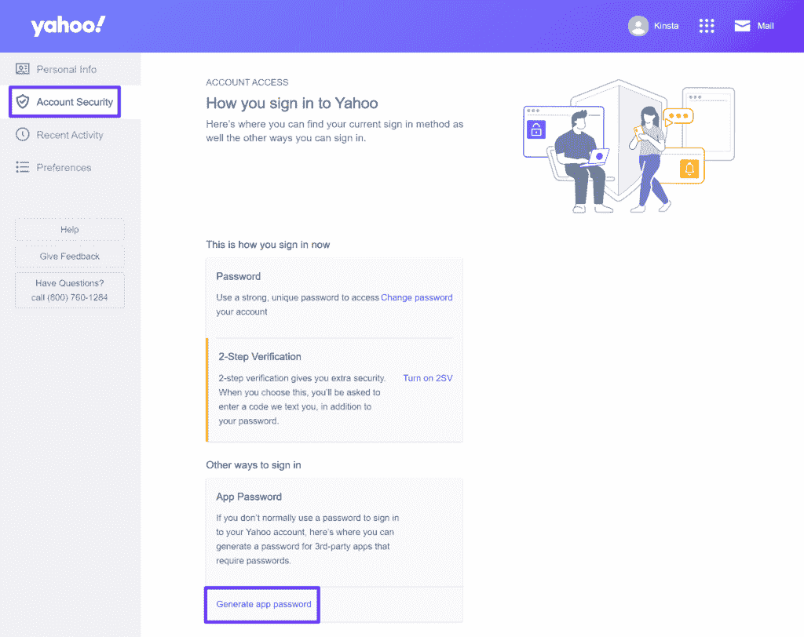
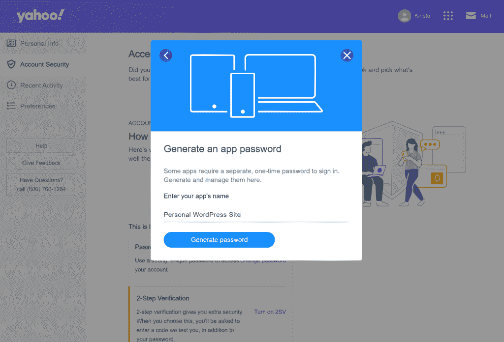
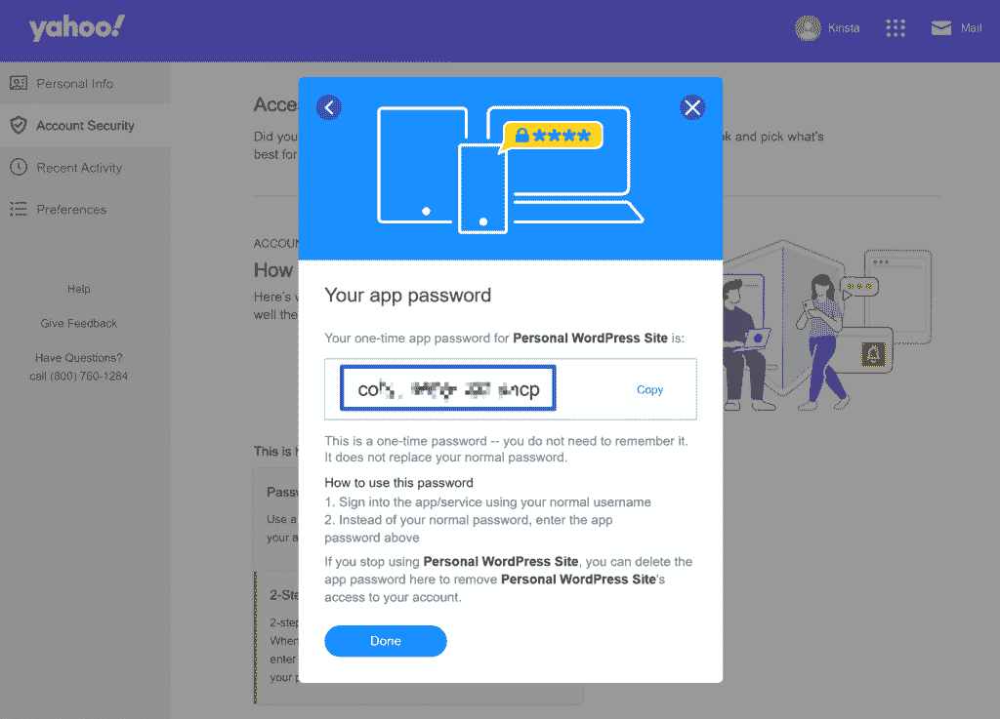
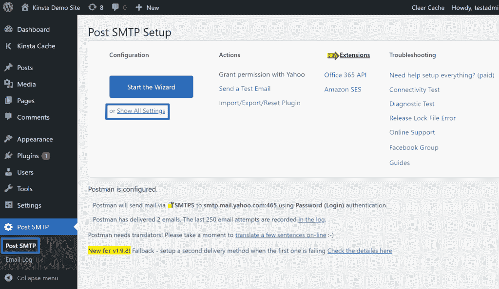
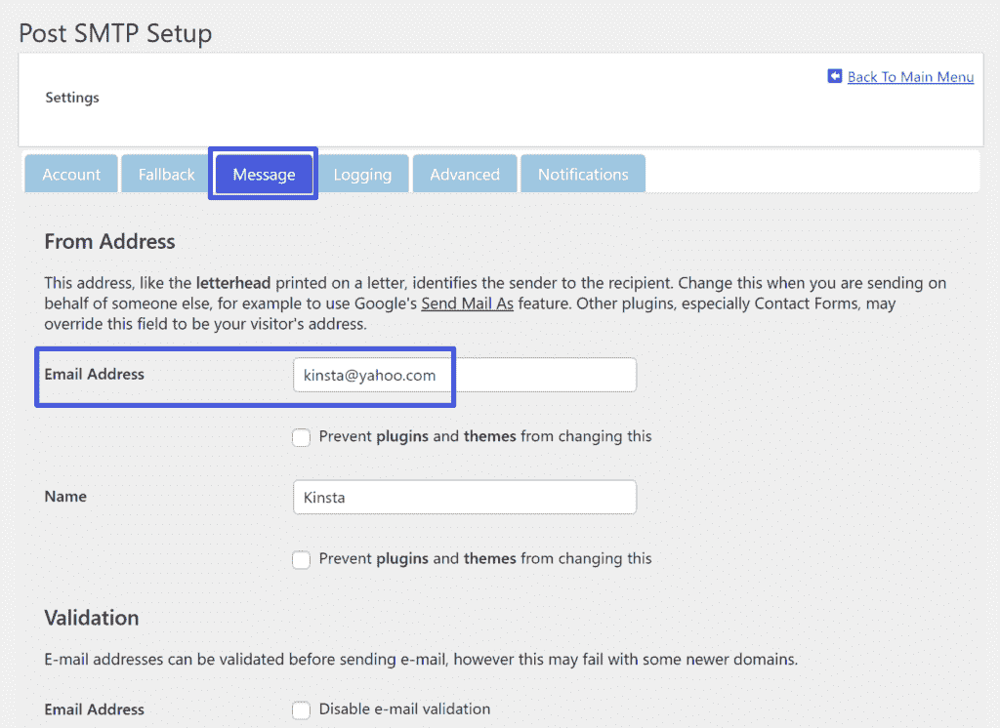
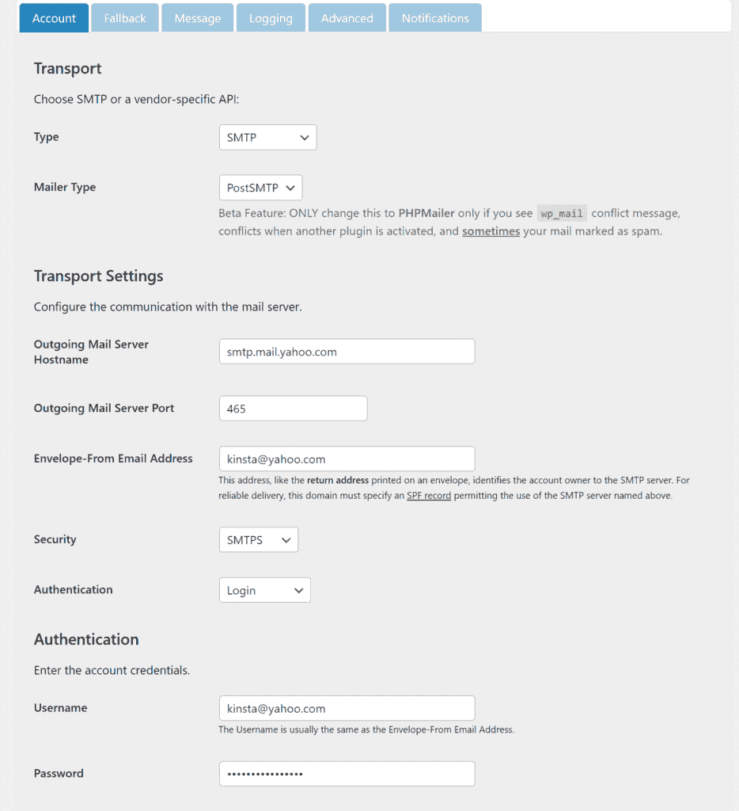
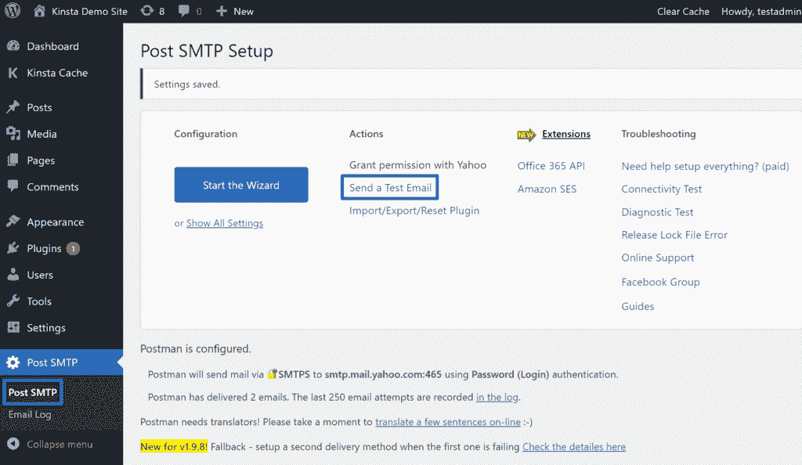
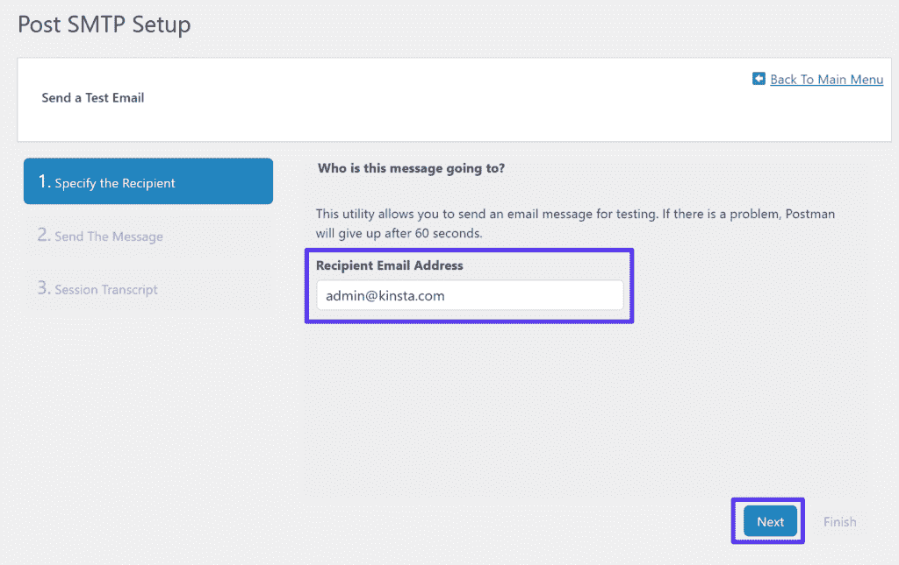
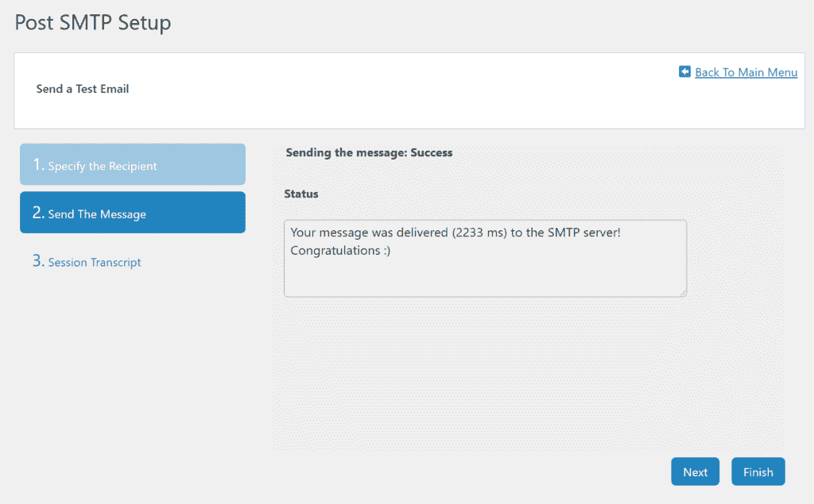
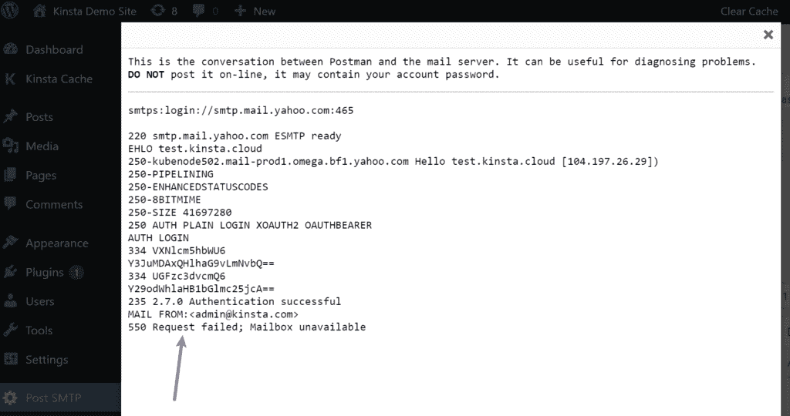

# 雅虎 SMTP 设置:如何连接电子邮件客户端或 WordPress 网站

> 原文：<https://kinsta.com/blog/yahoo-smtp-settings/>

搜索雅虎 SMTP 设置，如何连接雅虎 SMTP 服务器？

知道了这一点就打开了很多可能性。您可以配置您的桌面或移动电子邮件客户端使用您的雅虎邮件帐户发送和接收电子邮件。如果你有一个 WordPress 网站，你也可以配置你的网站使用雅虎邮箱的 SMTP 服务器发送邮件，这是一个很好的免费方法来提高你网站的邮件投递率。

在这篇文章中，我们将快速浏览雅虎 SMTP 服务器的细节，以及它的 POP3 和 IMAP 设置。然后，我们将向您展示如何将您的电子邮件客户端连接到 Yahoo SMTP 服务器。

稍后，我们将介绍如何配置你的 WordPress 站点，通过免费的 Yahoo Mail SMTP 服务器发送电子邮件。

激动吗？我们出发吧！

### 查看我们的[视频指南](https://www.youtube.com/watch?v=hs3bfyNZE6I)来配置雅虎 SMTP 设置以连接你的电子邮件客户端或 WordPress 站点

## 雅虎 SMTP 设置是什么？

首先，让我们直接进入雅虎 SMTP 设置。如果你需要额外的帮助，我们稍后会提供更多的相关信息。

以下是你需要的所有基本细节:

*   **SMTP 服务器**:smtp.mail.yahoo.com
*   **端口** : 465 或 587(了解更多关于 SMTP 端口的
*   **需要 SSL** :是
*   **需要 TLS** :是(如果有)
*   **认证**:是(如果有多个选项，请选择登录)
*   **用户名**:您的完整雅虎邮箱地址(例如[【电子邮件保护】](/cdn-cgi/l/email-protection))
*   **密码**:你的雅虎邮箱应用程序密码(它是*而不是*你用来登录雅虎邮箱的密码——我们将在下面告诉你如何生成它)

使用上面列出的 Yahoo SMTP 设置，Yahoo Mail SMTP 服务器允许您每天发送多达 500 封电子邮件。

### 如何为雅虎邮箱创建应用程序密码

要使用 Yahoo Mail SMTP 服务器，您首先需要创建一个专用的应用程序密码。此前，您可以使用您的雅虎邮箱密码，但雅虎更新了这一要求，以提高安全性。现在，您需要生成一个唯一的应用程序密码。

幸运的是，生成雅虎邮箱应用程序密码非常简单。首先，请转到您的帐户设置区域，然后点击**帐户安全**选项卡。

您可以通过点击右上角的用户名/图标来访问您的帐户设置区域。或者，你可以[点击这个链接直接进入账户安全区](https://login.yahoo.com/myaccount/security/)(只要你已经登录雅虎邮箱)。

然后点击**其他方式下的**生成 app 密码**链接进入**版块。

How to create a Yahoo Mail App Password.

您现在应该会看到一个弹出窗口。点击弹出菜单中的蓝色**开始**按钮前进。

输入你的应用名称，这只是一个内部名称，以帮助你记住它，例如，“WordPress”或“Thunderbird”请正确标记，因为这将帮助您记住密码连接的服务。接下来，点击**生成密码**按钮。

Add a name to help you identify your App Password.

然后你应该会看到应用程序密码——把它放在手边，因为当你在你使用的任何应用程序中配置雅虎邮件 SMTP 设置时，你会需要它。

The App Password from Yahoo Mail.

稍后，我们将向您展示如何在配置 WordPress 使用雅虎 SMTP 服务器时使用这个应用程序密码。

## 雅虎 POP3 设置是什么？

雅虎 SMTP 设置允许您配置您的电子邮件客户端或网站，以便通过雅虎邮箱发送电子邮件。但是如果你想把邮件导入你的邮件客户端，你还需要设置 POP3(或者 IMAP)来接收邮件。

雅虎 POP3 设置如下:

*   **服务器**:pop.mail.yahoo.com
*   **端口** : 995
*   **需要 SSL** :是
*   **用户名**:你完整的雅虎邮箱地址(如乔[【邮件保护】](/cdn-cgi/l/email-protection))
*   **密码**:你的雅虎邮箱应用程序密码(这是*而不是*你用来登录雅虎邮箱的密码——你可以按照上面 SMTP 部分的说明生成一个应用程序密码)

## 雅虎 IMAP 设置是什么？

IMAP 为您提供了另一种将电子邮件导入电子邮件客户端的方式。如果你打算从多个设备上访问你的电子邮件，IMAP 比 POP3 更好，因为它允许双向同步，而如果你只使用一个设备访问雅虎邮件，POP3 更好。

Yahoo IMAP 设置如下:

*   **服务器**:imap.mail.yahoo.com
*   **端口** : 993
*   **需要 SSL** :是
*   **用户名**:您的完整雅虎邮箱地址(例如[【电子邮件保护】](/cdn-cgi/l/email-protection))
*   **密码**:你的雅虎邮箱应用程序密码(这是*而不是*你用来登录雅虎邮箱的密码——你可以按照上面 SMTP 部分的说明操作)

## 如何为 WordPress 站点配置雅虎 SMTP

可以配置你的 WordPress 站点来使用 Yahoo Mail SMTP 服务器发送交易邮件。它可以让你利用雅虎邮箱每天 500 封邮件的慷慨发送限制，提高你的 WordPress 网站的邮件发送能力。

## 注册订阅时事通讯

### 想知道我们是怎么让流量增长超过 1000%的吗？

加入 20，000 多名获得我们每周时事通讯和内部消息的人的行列吧！

[Subscribe Now](#newsletter)

然而，雅虎邮箱并不总是与 WordPress 站点/主机兼容，你可能会在设置时遇到连接问题。这主要是因为雅虎邮箱有相当严格的防火墙规则来防止垃圾邮件。

出于这个原因，如果你遇到任何问题，我们建议使用另一个免费的 SMTP 服务器，比如 T2 的免费 Gmail SMTP 服务器，T4 的 SendGrid API。这些 SMTP 服务器更容易工作，而且和雅虎邮箱一样免费(Gmail SMTP 服务器也支持每天 500 封免费邮件)。

如果你想继续使用雅虎邮件 SMTP 服务器，这里有一些方法…

### 1.创建应用程序密码

要开始，请确保您已经按照上面的说明创建了一个雅虎邮箱应用程序密码。获得应用程序密码后，请将其保存在安全的地方，因为在下一步中会用到它。

### 2.安装并配置免费的 Post SMTP 插件

要配置 WordPress 通过 SMTP 发送邮件，你需要一个 WordPress SMTP 插件。有很多很棒的免费 SMTP 插件，但是我们推荐免费的 Post SMTP 插件,因为它包含了你需要的所有特性，并且可以很容易地调试问题。

首先，安装并激活 WordPress.org 的免费 Post SMTP 插件。然后，转到你的 WordPress 仪表盘中新的 **Post SMTP** 区域，点击**显示所有设置**链接。

Showing all settings in Post SMTP.

在设置区域，转到**消息**选项卡，输入您的“发件人”电子邮件地址和姓名。

**您的“发件人”电子邮件地址必须是您的雅虎邮箱地址**。

如果你尝试使用不同的电子邮件地址，雅虎邮箱会阻止连接，你会在你的邮件日志中看到一条错误信息(可能是“550 请求失败；邮箱不可用”错误)。

厌倦了低于 1 级的 WordPress 托管支持而没有答案？试试我们世界一流的支持团队！[查看我们的计划](https://kinsta.com/plans/?in-article-cta)

Make the “From” email the same as your Yahoo Mail address.

点击底部的**保存更改**。然后，返回设置区域(您可能需要再次点击**显示所有设置**)。

在设置区的**账户**选项卡中，选择 **SMTP** 作为传输**类型**，并将**邮件程序类型**设置为等于**邮政 SMTP** 。您应该会在屏幕底部看到一个新的设置列表。

以下是配置它们的方法:

*   **发送邮件服务器主机名**:smtp.mail.yahoo.com
*   **发送邮件服务器端口** : 465(如果您遇到问题，也可以尝试端口 587)
*   **信封-发件人电子邮件地址**:你的雅虎邮箱地址。同样，如果您使用不同的电子邮件地址，您可能会遇到错误。
*   **安全** : SMTPS
*   **认证**:登录
*   **用户名**:你的雅虎邮箱地址。
*   **密码**:您在第一步生成的雅虎邮箱 app 密码(这是**而不是**您用来登录雅虎邮箱的密码)。

How to configure Post SMTP to use Yahoo Mail

然后，点击底部的**保存更改**保存您的设置。
T3】

### 3.发送测试消息

至此，您已经完成了配置。为了确保一切正常，您可以通过 **Post SMTP** 发送一封测试邮件。

转到 **Post SMTP** 然后点击**动作**栏中的**发送测试邮件**链接:

How to send a test email with Post SMTP

输入您想要发送测试邮件的电子邮件地址，然后点击**下一步**:

Enter the email address where you want to send the test email

如果您已经正确设置了一切，您应该在 **Post SMTP Setup** 界面中看到一条成功消息。您还应该会在您输入的电子邮件地址收到一封电子邮件。

The success message in Post SMTP

如果消息发送失败，您可以从 **Post SMTP → Email Log 查看问题日志。**

将鼠标悬停在失败的消息上，并单击**查看会议记录**链接。在这里，您可以看到由于**信封发件人**电子邮件地址与 Yahoo Mail 电子邮件地址不匹配而无法发送的邮件的日志。

您可以看到它触发了一个 **550 请求失败**错误:

An example of an error log in Post SMTP

如果你在确保你的“发件人”电子邮件地址与你的雅虎邮箱地址匹配后仍然遇到问题，你可以考虑使用[另一个免费的 SMTP 服务器](https://kinsta.com/blog/free-smtp-server/)，比如[免费的 Gmail SMTP 服务器](https://kinsta.com/blog/gmail-smtp-server/)。

[Want to know how to connect your email client to the Yahoo SMTP server? 👀 You've come to the right place. Click to get started with this helpful guide ⬇️Click to Tweet](https://twitter.com/intent/tweet?url=https%3A%2F%2Fkinsta.com%2Fblog%2Fyahoo-smtp-settings%2F&via=kinsta&text=Want+to+know+how+to+connect+your+email+client+to+the+Yahoo+SMTP+server%3F+%F0%9F%91%80+You%27ve+come+to+the+right+place.+Click+to+get+started+with+this+helpful+guide+%E2%AC%87%EF%B8%8F&hashtags=SMTP%2CEmailTips)

## 摘要

如果您有 Yahoo Mail 帐户，Yahoo SMTP 服务器允许您配置电子邮件客户端和网站，以便使用您的 Yahoo Mail 帐户发送电子邮件。要配置电子邮件客户端，您还可以使用 POP3 或 IMAP 将您的 Yahoo Mail 电子邮件导入到您的电子邮件客户端，以便从客户端发送和接收电子邮件。

因为雅虎邮箱允许每天发送多达 500 封邮件，所以它可以成为 WordPress 交易邮件的一个优秀的免费解决方案。然而，由于雅虎严格的防火墙和反垃圾邮件规则，你可能会遇到设置问题。因此，如果你在用 WordPress 设置雅虎邮箱时遇到反复出现的问题，你最好使用另一个免费的 SMTP 服务器。

关于雅虎 SMTP 设置或者如何在 WordPress 上使用它们，你还有任何问题吗？请在评论中告诉我们！

* * *

让你所有的[应用程序](https://kinsta.com/application-hosting/)、[数据库](https://kinsta.com/database-hosting/)和 [WordPress 网站](https://kinsta.com/wordpress-hosting/)在线并在一个屋檐下。我们功能丰富的高性能云平台包括:

*   在 MyKinsta 仪表盘中轻松设置和管理
*   24/7 专家支持
*   最好的谷歌云平台硬件和网络，由 Kubernetes 提供最大的可扩展性
*   面向速度和安全性的企业级 Cloudflare 集成
*   全球受众覆盖全球多达 35 个数据中心和 275 多个 pop

在第一个月使用托管的[应用程序或托管](https://kinsta.com/application-hosting/)的[数据库，您可以享受 20 美元的优惠，亲自测试一下。探索我们的](https://kinsta.com/database-hosting/)[计划](https://kinsta.com/plans/)或[与销售人员交谈](https://kinsta.com/contact-us/)以找到最适合您的方式。