# 如何在 WordPress 上使用 Yoast SEO:完整教程

> 原文:# t0]https://kinta . com/blog/yoast-SEO/

每个 WordPress 网站都需要一个搜索引擎优化插件。这就是你如何有机会让你的页面出现在[搜索引擎](https://kinsta.com/blog/alternative-search-engines/)的排名中。说到 SEO 插件， [Yoast SEO](https://wordpress.org/plugins/wordpress-seo/) 是目前最受欢迎的选项之一。然而， [WordPress SEO](https://kinsta.com/blog/wordpress-seo/) 难免是个复杂的话题。

幸运的是，为了解决这个问题，Yoast SEO 有很多内置功能，让你精确控制网站的 SEO。此外，我们在这里指导你通过所有的主要部分，使搜索引擎优化不那么令人生畏。

在本帖中，我们将分享一个 Yoast SEO 初学者指南，包括首次提示和基本设置。然后，我们将继续学习更高级的 Yoast SEO 指南，包括元变量的使用、模式设置等等。我们开始吧！

## Yoast SEO 初学者指南

在这一节中，我们将讨论如果你是 Yoast SEO 新手，你需要知道的事情。您将了解到:

*   如何在配置向导中正确输入信息
*   什么是 Yoast SEO 元框，它是如何工作的
*   你能从 Yoast SEO 仪表板做什么

然后，在下一节，我们将进入一些更高级的 Yoast SEO 设置。

> Kinsta 把我宠坏了，所以我现在要求每个供应商都提供这样的服务。我们还试图通过我们的 SaaS 工具支持达到这一水平。
> 
> <footer class="wp-block-kinsta-client-quote__footer">
> 
> 
> 
> <cite class="wp-block-kinsta-client-quote__cite">Suganthan Mohanadasan from @Suganthanmn</cite></footer>

[View plans](https://kinsta.com/plans/)

[Take a deep dive into how you can use Yoast to boost your WordPress site's SEO. 👍Click to Tweet](https://twitter.com/intent/tweet?url=https%3A%2F%2Fkinsta.com%2Fblog%2Fyoast-seo%2F&via=kinsta&text=Take+a+deep+dive+into+how+you+can+use+Yoast+to+boost+your+WordPress+site%27s+SEO.+%F0%9F%91%8D&hashtags=SEO%2CWordPress)

### 使用 Yoast SEO 配置向导

在安装了 Yoast 之后，你可以在你的 WordPress 管理区点击新的 **Yoast SEO** 标签来访问仪表盘。

如果这是您第一次使用该插件，您应该会看到一个大提示，您可以点击**开始首次配置**:

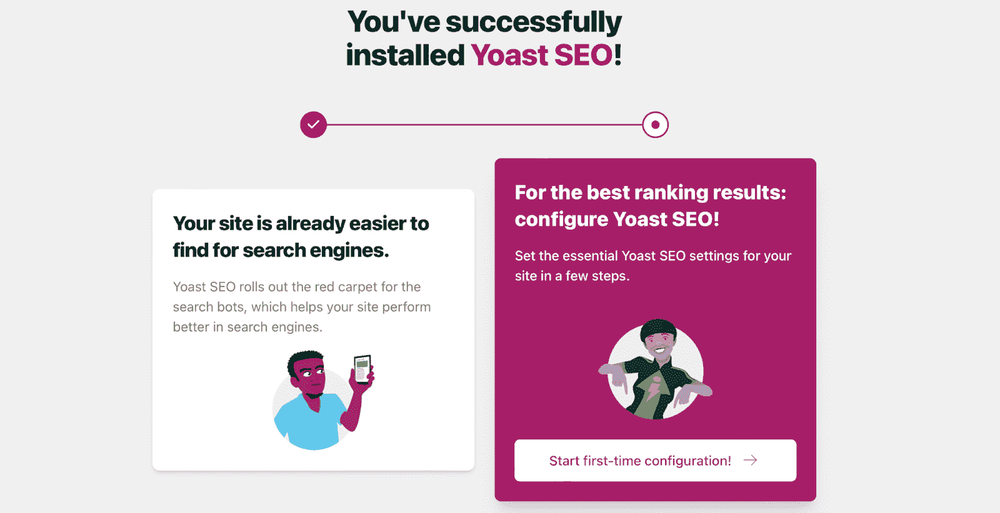

First-time Yoast SEO configuration

通过点击配置向导按钮，你可以开始在 WordPress 上配置 Yoast SEO，这样 Google 可以更好地理解你的内容。

下面，我们将带您了解配置向导的主要部分。

#### **第一节:SEO 数据优化**

在 SEO 数据优化区，你可以使用 Yoast 的索引来立即改善你网站上的任何技术问题。它的工作方式类似于谷歌分析你的网站。但是，如果您有很多内容，这可能需要一点时间:

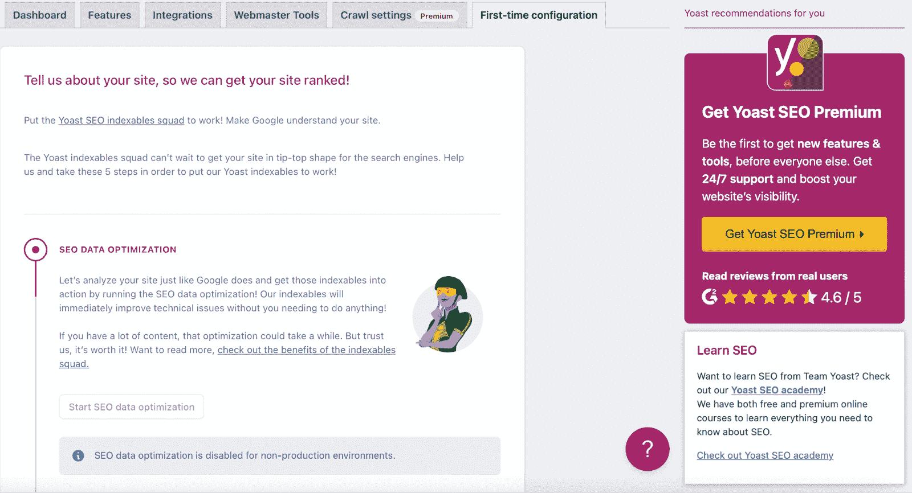

Yoast Configuration Wizard- SEO data optimization

但是，需要注意的是，该设置仅适用于生产环境。因此，如果您的网站是非生产环境，您只需点击**继续。**

#### **第二部分:现场展示**

在“网站表示”部分，选择与您的网站最匹配的网站类型。如果您的站点代表一个人，请使用下拉菜单指定用户。如果您的站点代表一个组织，请输入公司名称:

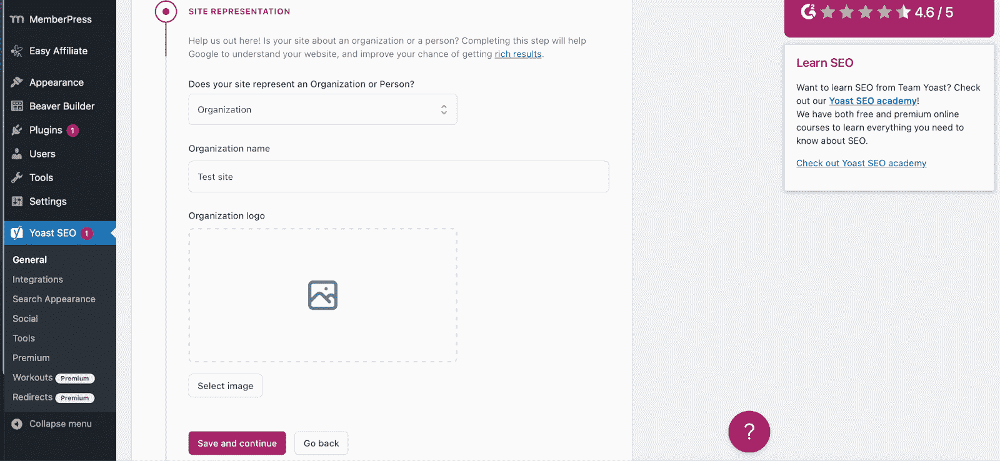

Determine your Yoast SEO site representation

再往下，你可以从你的媒体库或电脑上传一个公司标志。这至少需要是 [112x112px](https://developers.google.com/search/docs/data-types/logo) 。我们也建议选择正方形的图片。

然后，点击**保存并继续**继续。

#### **第三部分:社交档案**

接下来，您可以输入您网站的所有社交媒体资料。如果您正在为组织创建网站，这将是您组织的社交媒体个人资料:

Add social media profiles to Yoast SEO

如果你是一个单独的用户，你可以在你的 WordPress 个人资料页面上编辑细节，比如用户的社交资料、名字和描述。

你不需要输入所有的信息——只需选择你积极想要推广的[社交媒体](https://kinsta.com/blog/wordpress-social-media-plugins/)个人资料。

#### **第四部分:个人偏好**

在个人首选项部分，您可以决定是否希望 Yoast SEO 跟踪您的网站数据:

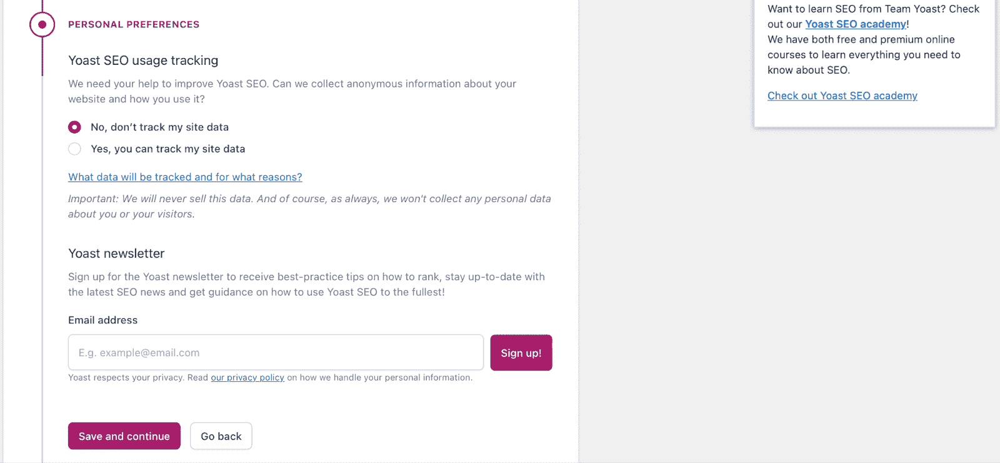

Adjust your personal preferences with Yoast SEO

如果你愿意，你也可以订阅 Yoast 时事通讯。

#### **第 5 部分:完成配置**

最后，您需要完成 Yoast SEO 配置。在这里，您还可以注册参加 Yoast 的免费每周网络研讨会。

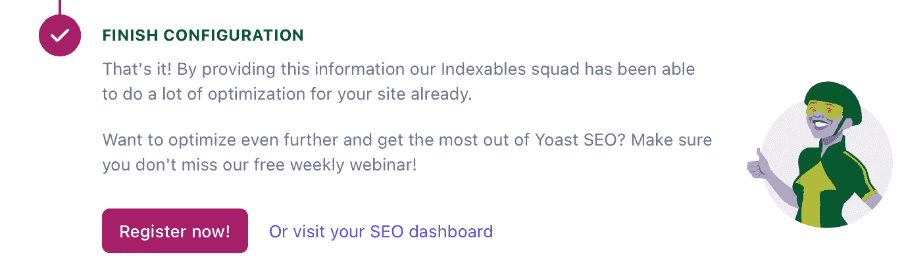

Finish configuring Yoast SEO on WordPress

祝贺您–您刚刚配置了 Yoast SEO！现在，您可以通过链接直接进入新的 Yoast 仪表盘。

### 使用 Yoast SEO 元框

在日常生活中，Yoast SEO 元框是你与插件互动最多的地方。元框通过以下方式帮助您:

*   分析你的内容的搜索引擎优化质量和可读性
*   允许您配置内容在 Google 和社交媒体中的功能设置

元框出现在 WordPress 编辑器的下面(它的确切位置取决于你的其他插件和主题):

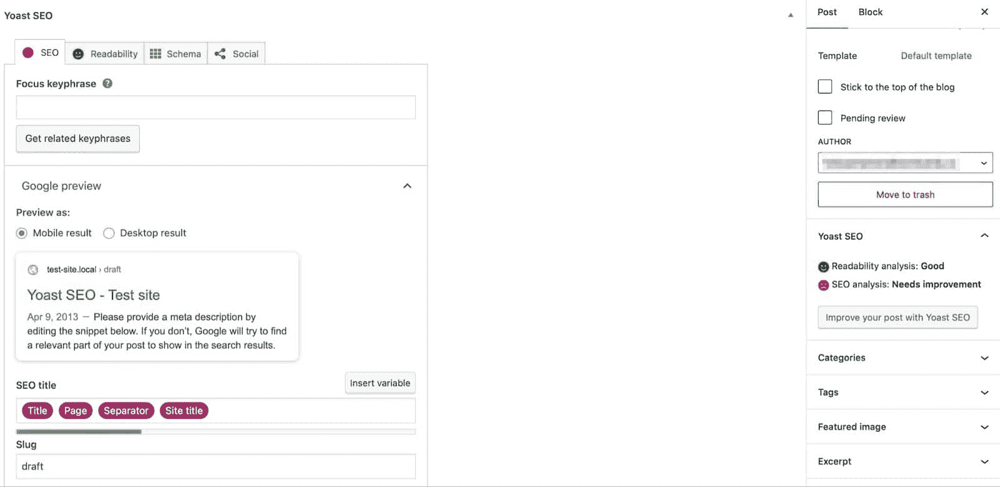

he Yoast SEO meta box in WordPress

如果你正在使用新的 [WordPress 块编辑器](https://kinsta.com/blog/gutenberg-wordpress-editor/)，你也可以在右边栏找到这个部分。

#### SEO **标签页**

SEO 标签主要是关于你的内容对于搜索引擎的优化程度。

“内容优化”选项卡中的第一个区域是焦点关键短语。本质上，你需要[进行一些基本的关键词研究](https://kinsta.com/blog/keyword-research/)来找到人们正在搜索的关键词。

然后，你把那个关键词插入这个框，Yoast SEO 会分析你的内容，看看你的文章对那个特定关键词的优化程度:

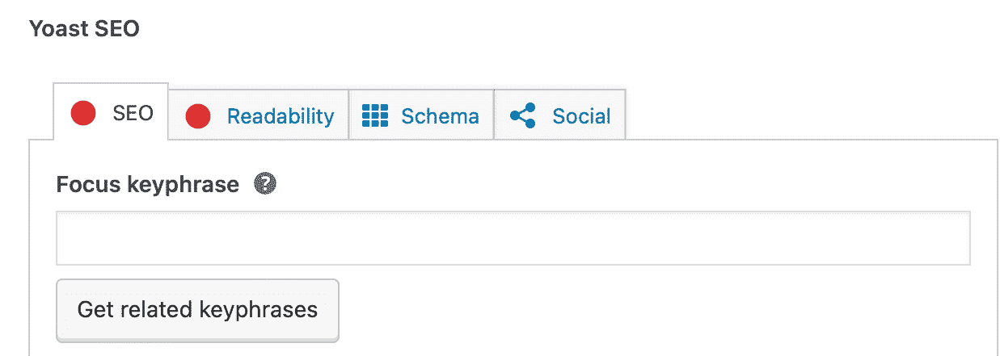

Set a Yoast SEO Focus Keyphrase

重要的是要记住，Yoast 焦点关键词不会帮助你在谷歌中排名。这只是帮助你优化内容的建议。

在那下面，你会看到谷歌预览。您可以通过调整您的 SEO 标题和[元描述](https://kinsta.com/blog/meta-description-wordpress/)来手动编辑片段。当您编辑信息时，您将看到实时预览的调整。另外，绿灯表明你的搜索引擎优化标题是一个最佳长度:

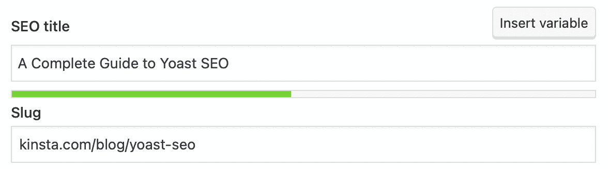

Choose a Yoast SEO title and slug in WordPress

在这里，你也可以为你的帖子输入一个[独特的 slug](https://kinsta.com/blog/wordpress-permalinks/) 。这是访问者可以找到您的内容的 URL。例如，我们这篇文章的 slug 可能看起来像这样:【kinsta.com/blog/yoast-seo.的 T2】

这些搜索引擎优化信息很重要，因为它会出现在谷歌的有机搜索结果中:

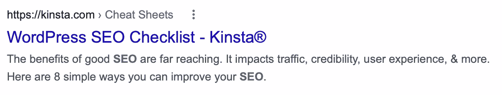

SEO snippet

您还可以通过展开 **SEO 分析**部分来访问 SEO 分析:

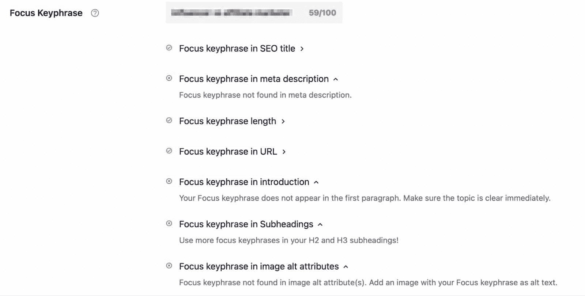

Yoast SEO analysis

这将从 SEO 的角度评估你的内容。例如，你会得到你的文章的总分。此外，你可以通过你的图片 alt 属性、 [meta 描述](https://kinsta.com/blog/meta-description-wordpress/)、出站链接、关键词分布等来判断需要改进的地方。

值得注意的是，使用 Yoast Premium，您可以获得高级 SEO 分析，设置额外的关键短语，并跟踪您的 SEO 性能。

在这个部分下面，您会看到一个**基础内容**选项卡。在这里，您可以选择是否将文章指定为基础内容。

[基石内容](https://yoast.com/what-is-cornerstone-content/)是你网站的核心。它包含了你网站上最好、最重要的文章；您希望在搜索引擎中排名最高的页面或帖子。基础文章通常相对较长，内容丰富，结合了不同博客文章的见解，涵盖了某个主题的所有重要内容。

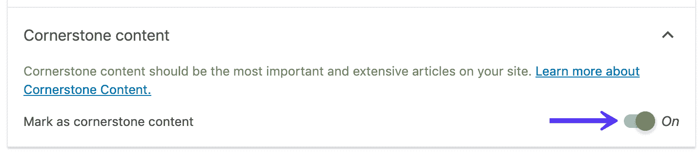

Cornerstone content

换句话说，只选择你最好的内容和你要保持更新的帖子/页面作为基础内容。然后，您可以轻松地根据帖子和页面列表中的基础内容进行排序。

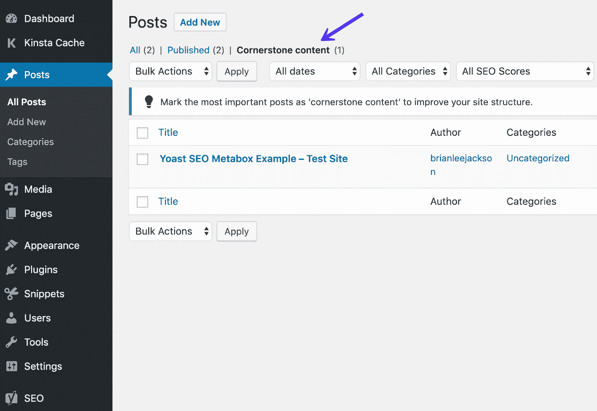

Cornerstone content in post list

大多数时候，你不会看**高级**标签。但是您可以使用它来:

*   阻止谷歌索引这个特定的内容。或者换句话说，允许或不允许搜索引擎在搜索结果中显示它。
*   禁止搜索引擎跟踪您页面上的链接。
*   指定一个规范的 URL 以避免重复内容。
*   [控制页面上面包屑](https://kinsta.com/blog/wordpress-breadcrumbs/)的外观。

如果您对更改任何默认设置感兴趣，请打开此选项卡:

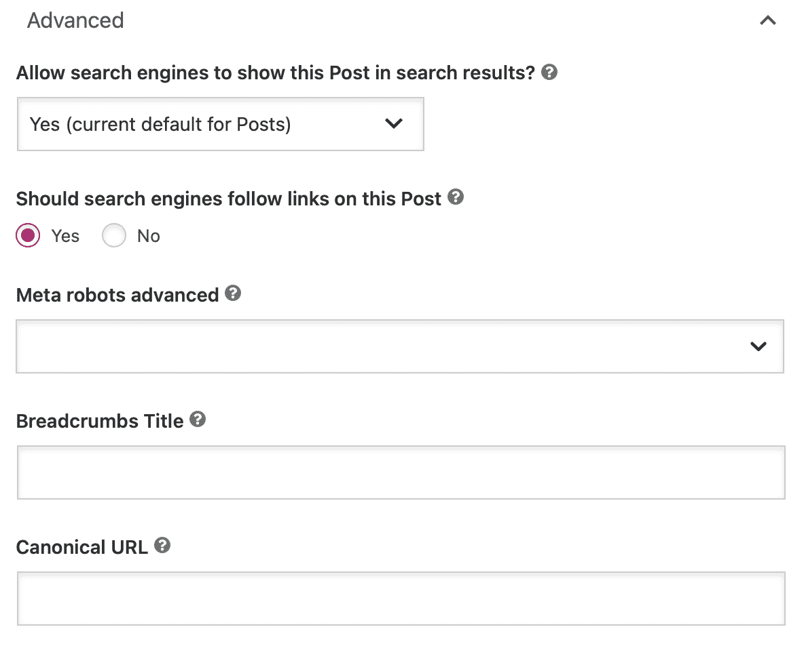

Yoast SEO Advanced tab

如果你想使用[面包屑标题](https://yoast.com/help/implement-wordpress-seo-breadcrumbs/#how-do-i-implement-yoast-seo-breadcrumbs-site-wide)功能，你需要确保你的活动主题启用了面包屑。

#### 可读性标签

在**可读性分析**领域，Yoast SEO 试图将同样的概念应用于人类。本质上，它试图衡量你的内容对人类访问者的可读性，然后提出一些如何改进你的内容的建议。

这些建议并不完美，所以不要觉得你需要得到高分。但它们是一个很好的向导:

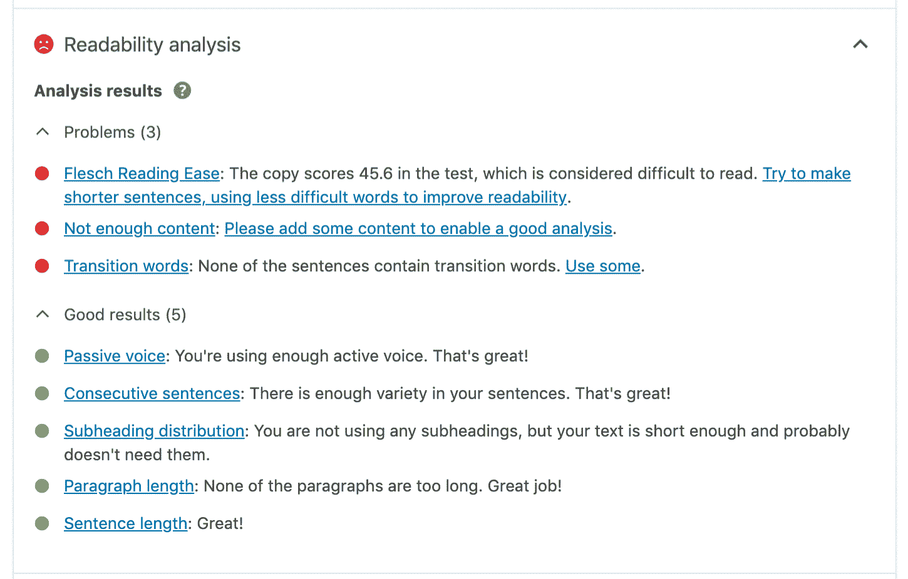

Yoast SEO Readability analysis

正如你所看到的，Yoast(和搜索引擎)更喜欢使用主动语态的内容，用副标题将大块文本分开，保持段落和句子简短。

您还会注意到，当您在帖子/页面上工作时，您可以在屏幕顶部看到绿色、橙色或红色的灯:

Readability score and SEO analysis

这让你可以快速查看你的可读性分数和你的 SEO 分析。这特别方便，因为它是实时更新的。

#### 社交标签

在**社交**选项卡中，您可以手动配置您的内容在脸书或 Twitter 上共享时的外观:

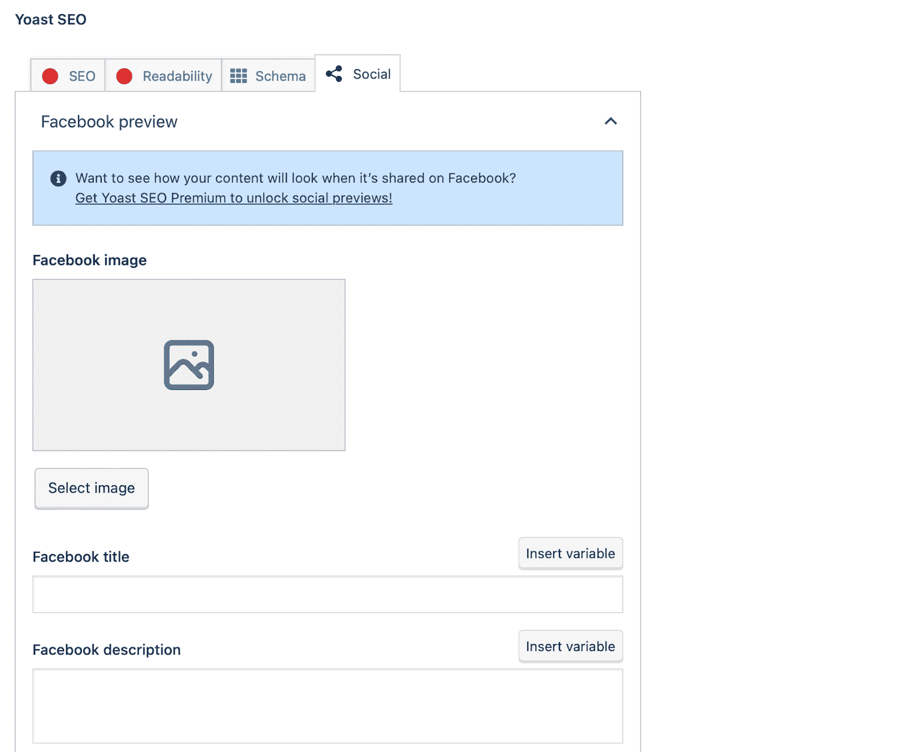

Social media settings for individual pieces of content

这是社交网络在分享 URL 时自动生成的信息:

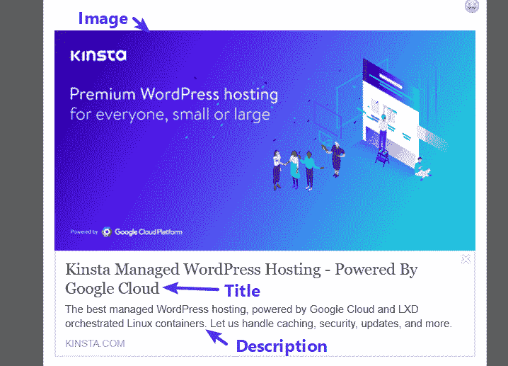

An example of how those social media settings affect things

大多数情况下，您不需要为每个帖子手动配置这些信息，因为 Yoast 会根据以下内容自动生成这些信息:

*   你的搜索引擎优化标题
*   您内容的特色图片

但是如果您想覆盖这些默认值，这就是您要做的。

但是，请记住，您需要 Yoast Premium 才能解锁您内容的社交预览。

#### **模式选项卡**

**Schema** 标签是 Yoast SEO 的新增功能，旨在帮助搜索引擎更好地理解你的内容。

例如，你可以明确地告诉搜索引擎你创建了什么类型的页面，比如默认帖子、关于页面、结帐页面等等:

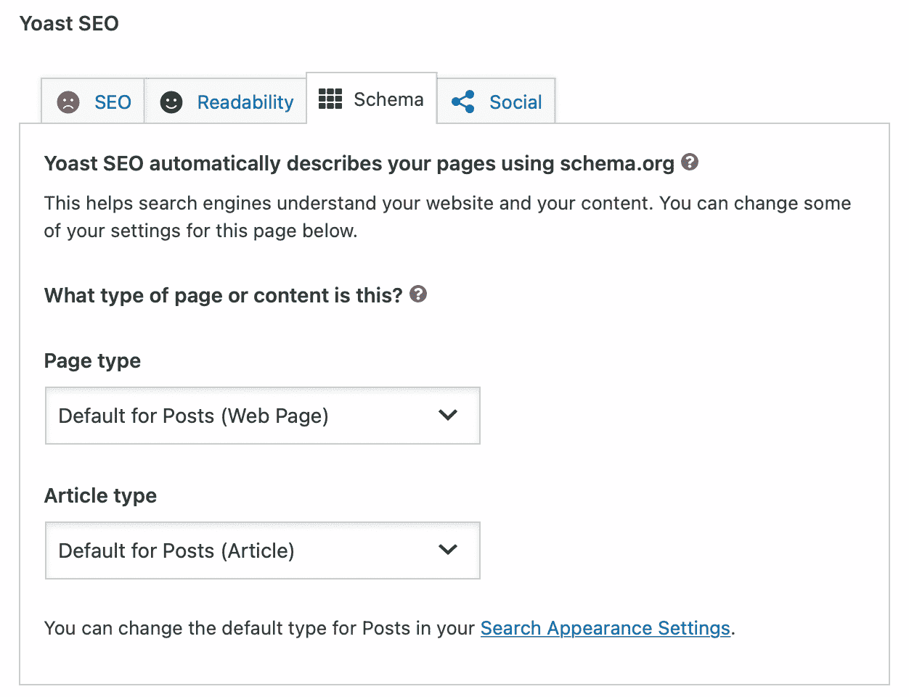

Yoast SEO Schema information

更好的是，你甚至可以使用下拉菜单选择文章类型。这允许你交流你的文章是一篇博客文章，一篇报道，一篇新闻文章，还是别的什么。

### 探索 Yoast SEO 仪表板

现在您已经配置了 Yoast SEO 并理解了元框，让我们看看仪表板。

## 注册订阅时事通讯

### 想知道我们是怎么让流量增长超过 1000%的吗？

加入 20，000 多名获得我们每周时事通讯和内部消息的人的行列吧！

[Subscribe Now](#newsletter)

在**仪表板**的主页上，您会收到关于您网站上任何潜在 SEO 问题的警告:

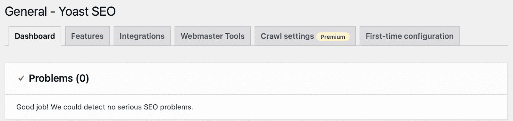

Dashboard notifications

Yoast 将提供如何修复这些问题的说明。或者，如果您不想处理它们，您可以随时取消通知。

#### **功能标签**

**的特点**标签是一个比以前的标签有点榨汁机。在这个区域中，您可以启用或禁用 Yoast SEO 的特定功能。

例如，如果你觉得 Yoast SEO 元框中的**可读性分析**没有帮助，你可以在这里关闭它:

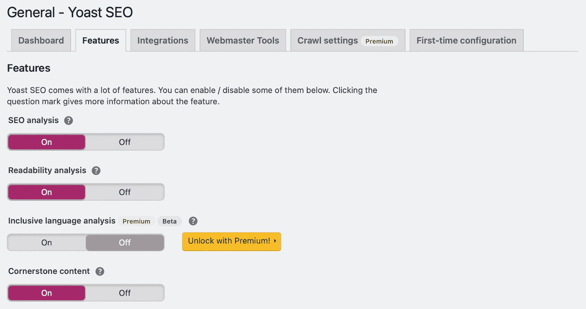

Yoast SEO features tab

这也是您可以启用/禁用作者安全性的地方。Yoast SEO 元框的高级部分允许用户从搜索结果中删除帖子或更改规范。

这些是你可能不希望任何作者做的事情。这就是为什么默认情况下，只有编辑和管理员可以这样做。将滑块设置为“关闭”允许所有用户更改这些设置。

正在寻找您的 [XML 站点地图](https://kinsta.com/blog/wordpress-sitemap/)？Yoast SEO 可以帮助您自动生成 XML 站点地图，并提交给搜索引擎。

#### **集成选项卡**

如果您访问 Yoast **Integrations** 选项卡，您将被重定向到一个单独的集成页面:

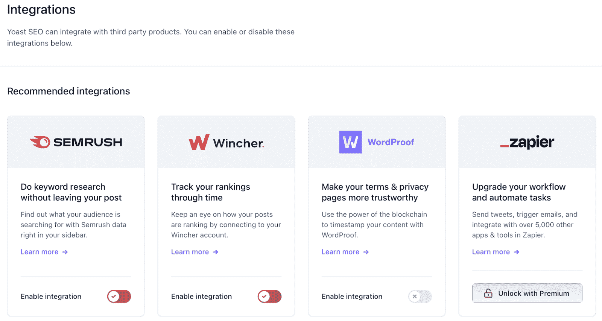

Yoast SEO Integrations page

其中一些集成仅适用于 Yoast Premium，如 Zapier 和 [WooCommerce](https://kinsta.com/blog/woocommerce-tutorial/) 。然而，那些可访问的，如 SEMrush 和 [Jetpack](https://kinsta.com/knowledgebase/wordpress-jetpack/) ，可以使用滑块来启用。

#### **站长工具选项卡**

在这个标签中，Yoast SEO 可以帮助你用各种搜索引擎站长工具来验证你的站点:

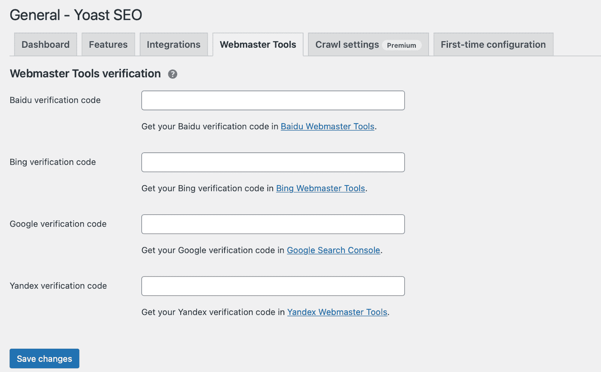

Various search engine tools

这个目前的名单包括[百度](https://kinsta.com/search-engine-market-share/#h-baidu)、[必应](https://kinsta.com/blog/bing-webmaster-tools/)、[谷歌](https://kinsta.com/search-engine-market-share/#h-google)和 [Yandex](https://kinsta.com/search-engine-market-share/#h-yandex) 。

在你的**站长工具**旁边，你会看到一个**抓取设置**标签。这仅适用于 Yoast Premium，使您能够更经济地抓取您的站点。例如，您可以删除 rest API 链接、生成器标签、帖子评论提要等等。

最后，您可以切换到**首次配置**选项卡，重新访问配置向导:

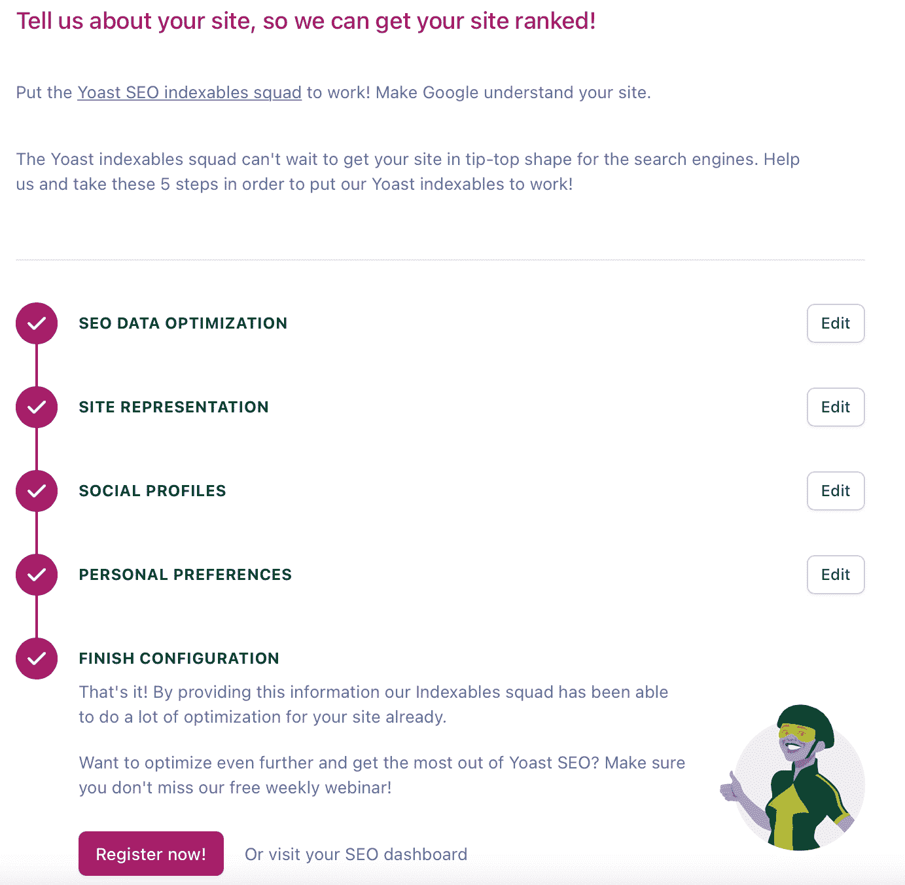

First-time configuration tab to revisit the Yoast configuration wizard

在这里，您可以返回到您的设置来更新您的个人偏好，编辑您的网站表现，并开始您的网站的搜索引擎优化数据优化。

## Yoast SEO 更高级的指南

恭喜你。至此，您应该对如何使用 Yoast SEO 的核心设置和功能有了相当扎实的理解。

然而，虽然我们已经探索了 Yoast **常规**部分和**集成**部分，但是你可以在你的 Yoast 侧边栏中看到 Yoast 的其他部分被隐藏了:

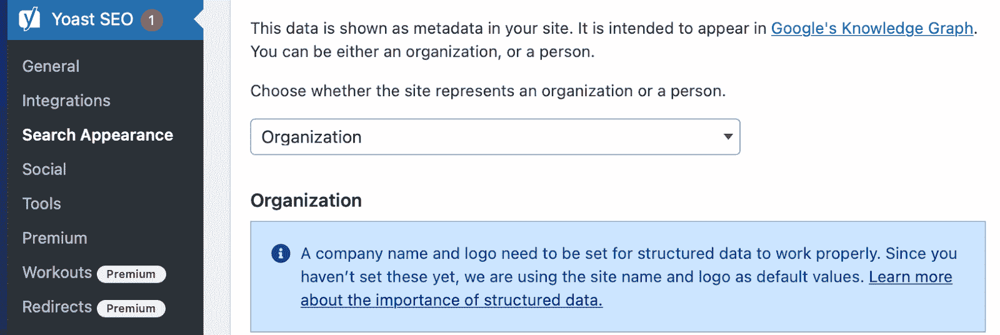

Yoast SEO advanced features

在下一节中，我们将带您了解其余的 Yoast SEO 设置。

### 搜索外观选项

需要编辑知识图表和 schema.org 数据吗？也许您没有使用配置向导来做到这一点。不要担心，因为你可以在**搜索外观**区域下访问它。

点击**常规**选项卡，编辑您的组织和/或个人数据:

Struggling with downtime and WordPress problems? Kinsta is the hosting solution designed to save you time! [Check out our features](https://kinsta.com/features/)

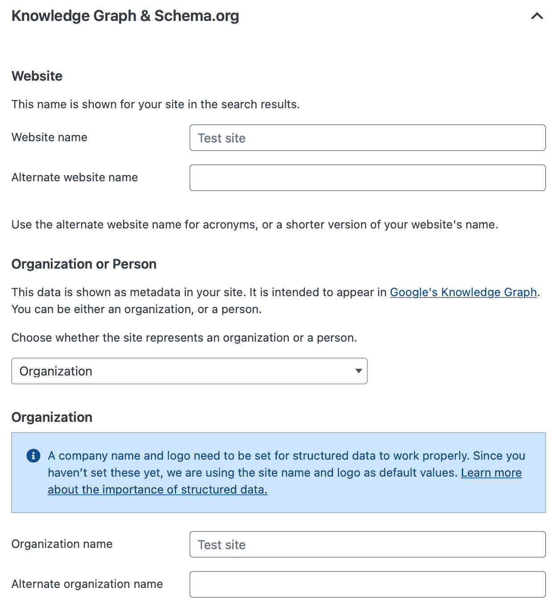

Knowledge Graph & Schema.org

截至 2019 年，Yoast SEO 版本 11+ [支持比以往更多的结构化数据](https://yoast.com/yoast-seo-11-0/)。它作为 JSON-LD 添加到您站点的代码中，支持组织、个人、网站、网页和文章模式。

你可以使用谷歌结构化数据测试工具来测试你的 WordPress 站点:

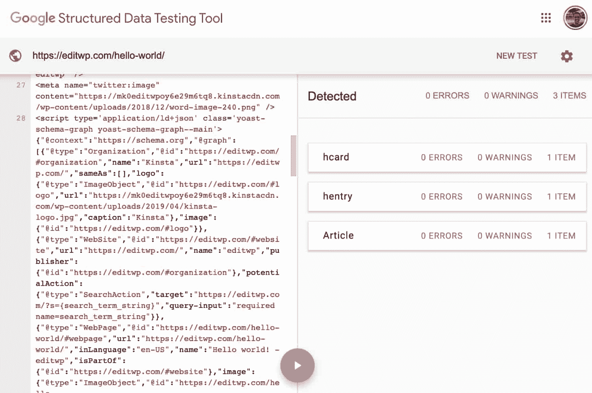

Google Structured Data Testing Tool

**搜索外观**也提供了一些很棒的方法来自动化你的页面搜索引擎优化。

在**内容类型**下，Yoast SEO 允许您为 SEO 标题设置模板，并为您的所有:

*   邮件
*   页
*   会员资格
*   盘问
*   课程
*   课程
*   制品
*   [自定义帖子类型](https://kinsta.com/blog/wordpress-custom-post-types/)
*   分类学
*   自定义分类法
*   存档页面

您可以通过展开相应的部分来完成此操作。例如， **Post** 部分看起来是这样的:

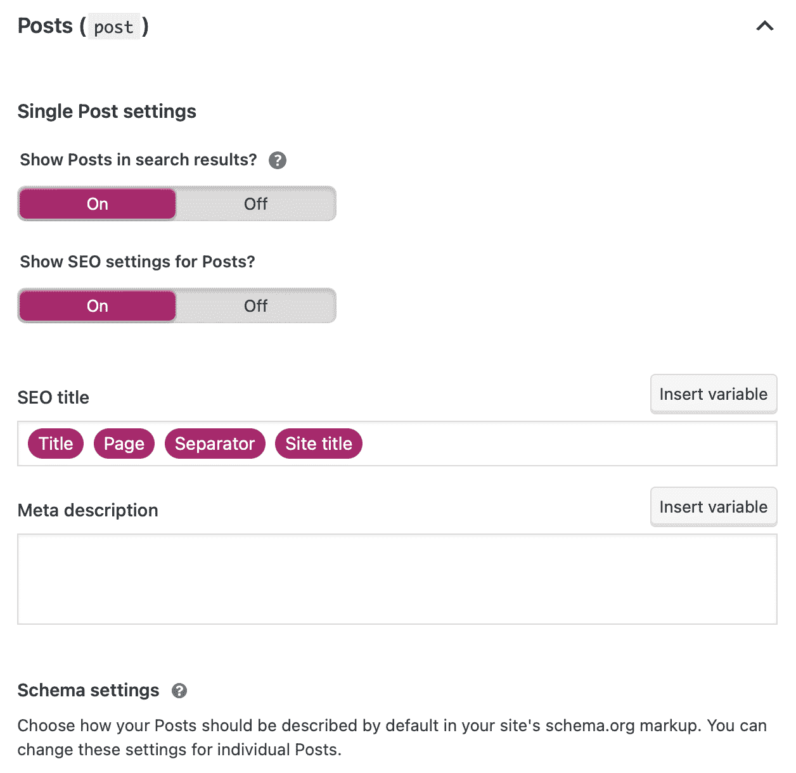

Content types

让这个功能如此强大的是，您可以使用各种各样的变量来动态插入包含在自定义字段中的信息。

只需点击**插入变量**即可访问一些最常见的变量:

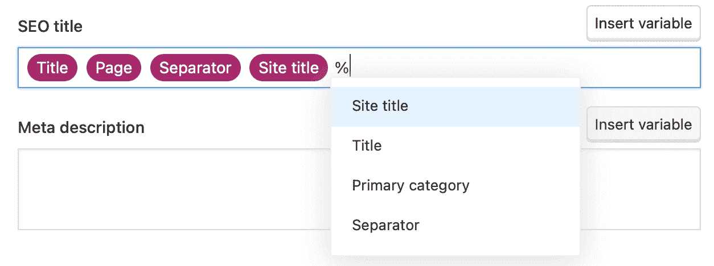

Some of the most common variables

在这个区域中，您还可以控制特定类型内容的 noindex 标记。如果你做了一些没有索引的东西，谷歌不会在搜索结果中索引这种类型的内容。这是强大的，所以要小心使用。只有当你知道你在做什么和它的含义时，才改变默认设置。

同时，在**内容类型**中，您可以决定是否应该为特定类型的内容显示 Yoast SEO 元框。

#### **分类选项卡**

如果你转到**分类**标签，你可以做一些很酷的事情来清理[你网站的永久链接](https://kinsta.com/blog/wordpress-permalinks/):

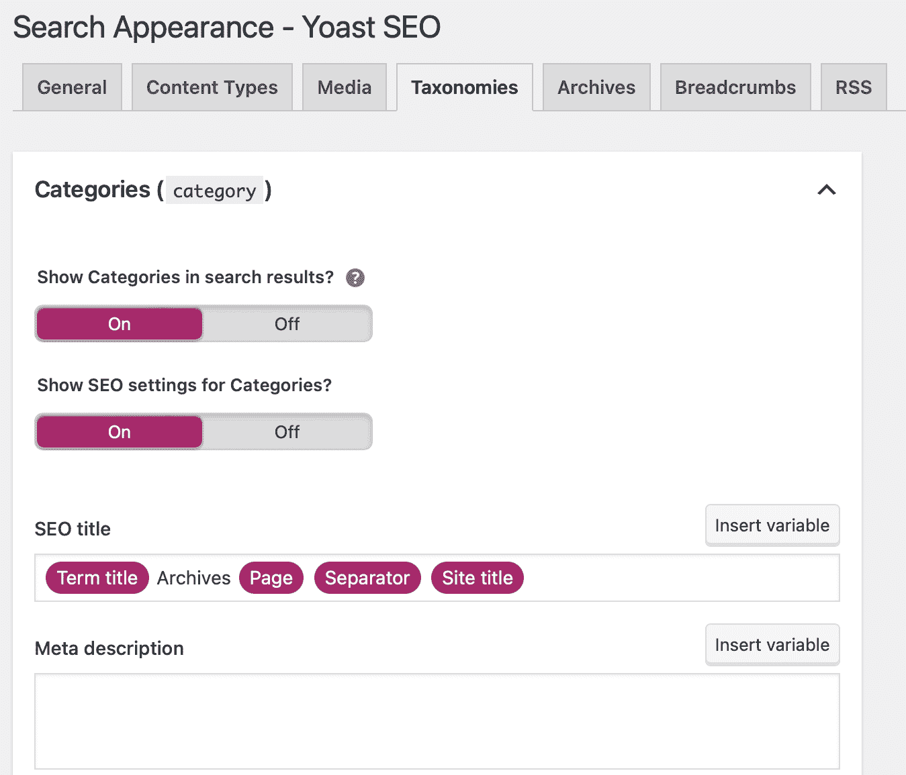

Yoast SEO taxonomies

最有用的功能之一是从你的[URL](https://kinsta.com/knowledgebase/what-is-a-url/)中删除类别 slug 的选项。

#### **档案页签**

**存档**选项卡允许您在搜索结果中禁用作者存档。此外，您可以在搜索引擎中显示没有帖子的作者的档案，并编辑您的作者档案的显示方式:

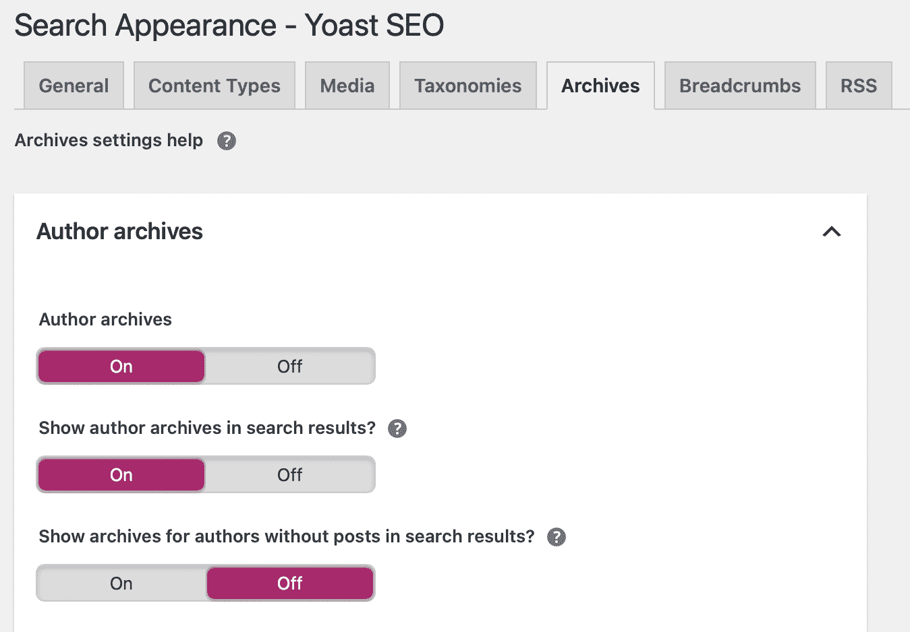

Yoast SEO author archives

如果您继续向下滚动，您可以控制是否在 Google 搜索结果中显示博客文章的发表日期:

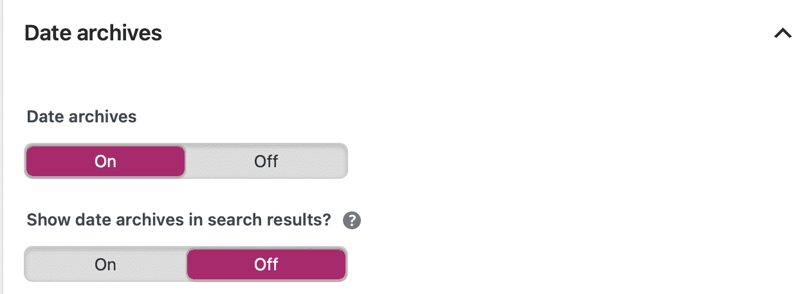

Date archives

如果您发布了 [evergreen 内容](https://kinsta.com/blog/evergreen-content/)，您应该关闭此功能。但是如果你发布新闻或者其他有时间限制的内容，这是一个不错的选择。

#### **面包屑标签**

面包屑是一种导航功能，如下所示:

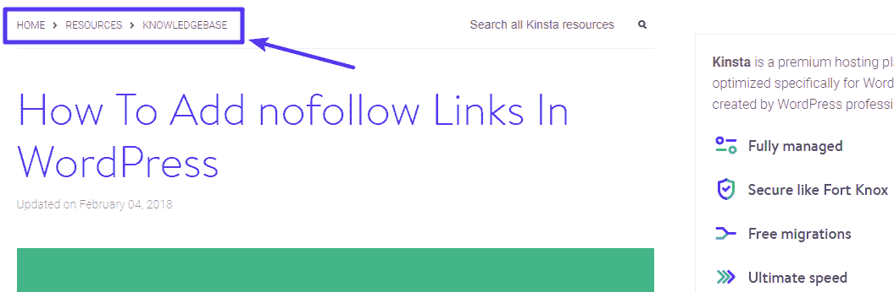

Example of breadcrumbs

它们通常被认为是帮助用户浏览你网站的积极因素。

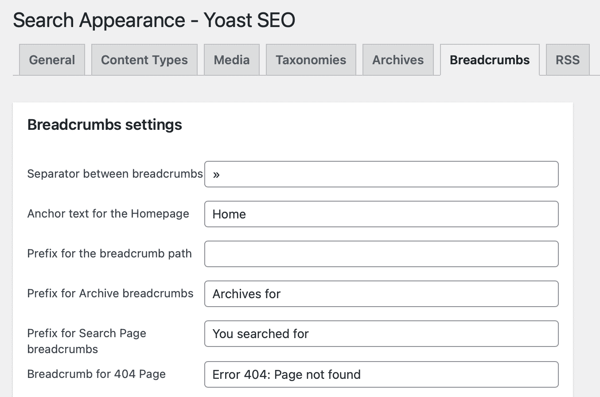

Breadcrumb settings inside Yoast SEO

在**面包屑**选项卡中，您可以通过 Yoast SEO 启用它们，并配置它们在您的页面上的显示方式:

如果您滚动到这一部分的底部，您可以为您的主题启用面包屑。虽然，这不适用于那些通过小部件或[短代码](https://kinsta.com/blog/wordpress-shortcodes/)插入的:

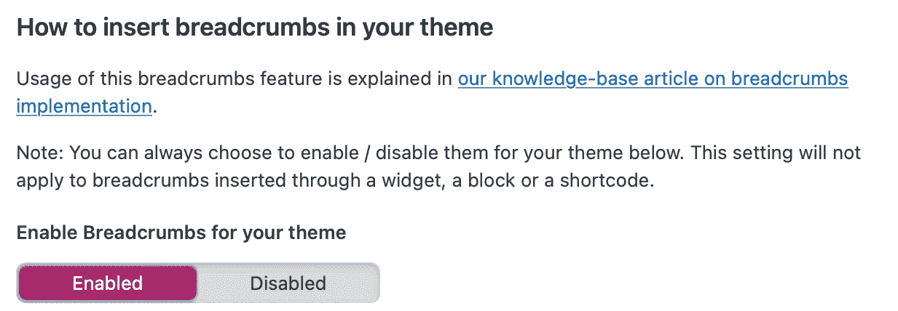

Enable breadcrumbs in Yoast SEO

其他时候，你可能需要[添加一小段代码片段](https://kb.yoast.com/kb/implement-wordpress-seo-breadcrumbs/)到你的主题中，以便让面包屑功能正常工作。更多关于 SEO 面包屑的[信息可以直接参考 Yoast。](https://yoast.com/help/implement-wordpress-seo-breadcrumbs/#utm_source=yoast-seo&utm_medium=software&utm_term=kb-breadcrumbs-how-to&utm_content=settings&utm_campaign=wordpress-support&php_version=7.4&platform=wordpress&platform_version=6.1&software=free&software_version=19.10&days_active=6-30&screen=wpseo_titles)

#### **RSS 选项卡**

最后， **RSS** 标签允许你在你的 [RSS 提要](https://kinsta.com/blog/wordpress-rss-feed/)中的文章之前或之后插入额外的内容。您还可以使用一些变量来动态插入信息，例如指向您的博客的链接，以确保正确引用:

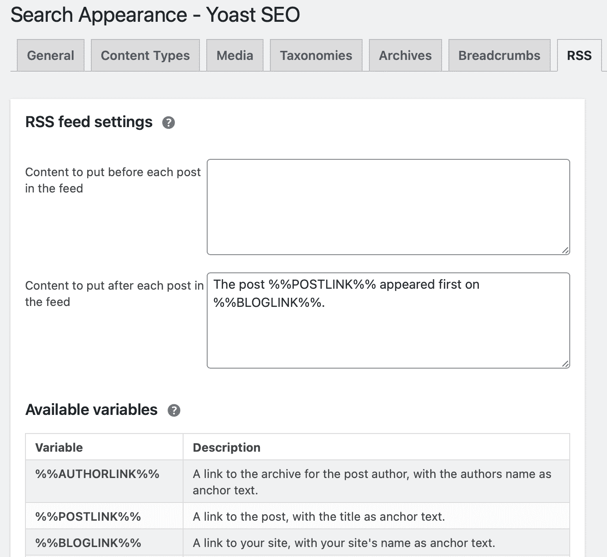

RSS feed settings

这使您可以在 RSS 提要中的帖子之前或之后添加内容

通过这种方式，搜索引擎可以正确地将您的网站识别为内容的原始来源。

### 社交选项

现在，我们可以进入**社交**部分，在这里你可以为你的网站如何与各种社交网络互动配置更多的常规设置。

大多数情况下，您会希望让它们保持原样:

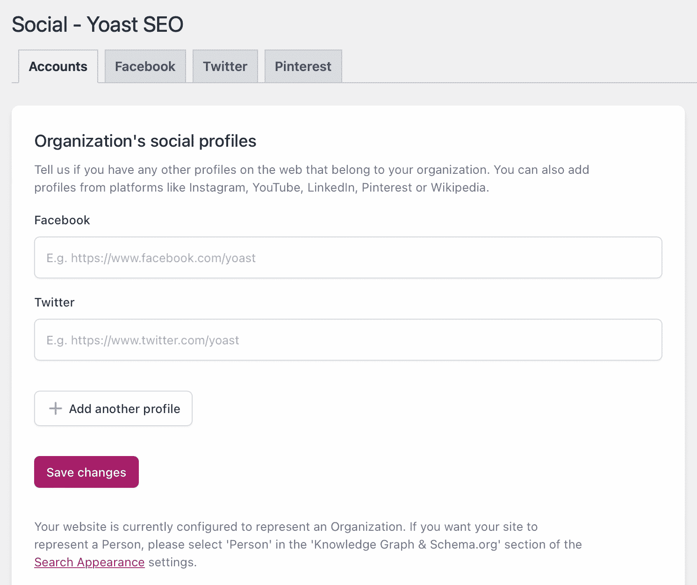

Yoast SEO advanced social media settings

Yoast SEO 的伟大之处在于，你不仅仅局限于脸书和 Twitter，就像你可以使用其他插件一样。相反，你可以在这里整理你所有的社交资料，包括 Instagram、YouTube 和 LinkedIn。

### 工具选项

最后，**工具**区域允许您访问各种类型的编辑器，以及导入或导出您的 Yoast SEO 设置的选项:

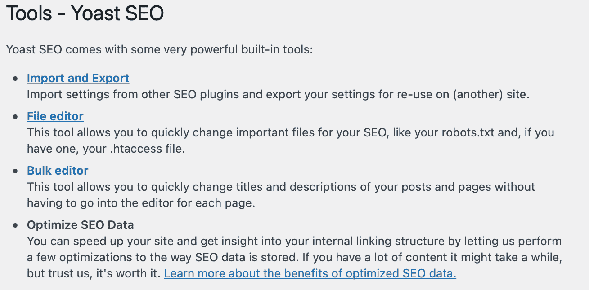

A list of the Yoast SEO Tools

你可以在这里做的一件有帮助的事情是从你的仪表板上编辑你的 WordPress 站点的 robots.txt 文件。没有必要把 [SFTP 变成你的地盘](https://kinsta.com/knowledgebase/how-to-use-sftp/)。

如果你点击**文件编辑器**，Yoast 会帮助你创建一个 robots.txt 文件(如果你还没有的话)。一旦你有了这个文件，你就可以在你的仪表盘上编辑它:

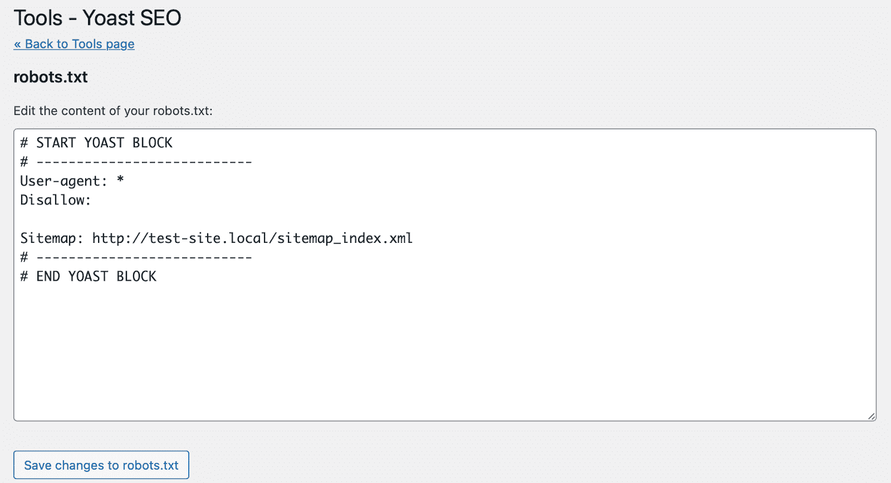

Edit your robots.txt file from your dashboard

如果您没有看到文件编辑器选项，这意味着两件事之一。

1.  你的[。htaccess 文件](https://kinsta.com/knowledgebase/wordpress-htaccess-file/)或 Nginx 中的文件夹在您的 web 服务器上不可写。你可以向你的主机提供商寻求帮助。
2.  你的 WordPress 安装禁用了[文件编辑](https://codex.wordpress.org/Hardening_WordPress#Disable_File_Editing)。

Yoast 免费版的最后一部分是 **Premium** 标签。在这里，您可以购买视频 SEO 和 WooCommerce SEO 等个人 Yoast 扩展。

或者，您可以选择整个 [Yoast Premium 套餐](https://yoast.com/reasons-to-upgrade/#utm_source=yoast-seo&utm_medium=software&utm_term=buy-button&utm_content=go-premium&utm_campaign=ad&php_version=7.4&platform=wordpress&platform_version=6.1&software=free&software_version=19.10&days_active=6-30&screen=wpseo_licenses)来访问相关关键词、社交预览和 24/7 支持:

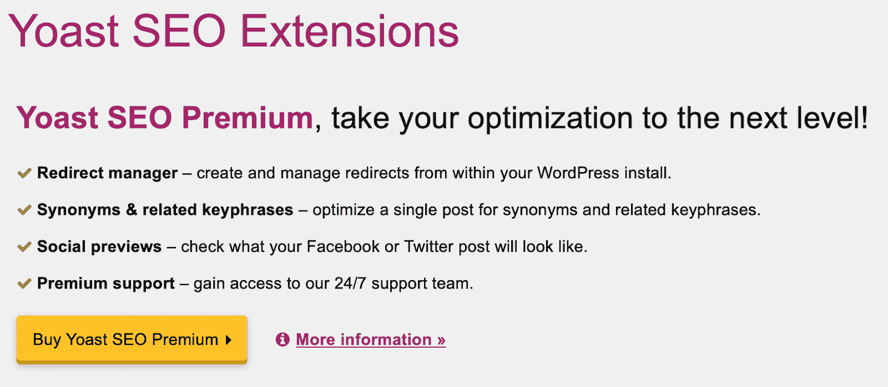

有了 Yoast Premium，您还可以访问另外两个部分。

**SEO 训练**带你通过一步一步的“训练”让你的网站进入 SEO 状态。例如，Yoast 可以给你的文章/页面添加内部链接，让你最重要的内容排名靠前。

更好的是，使用 **Yoast 重定向，**您可以轻松地设置普通重定向和正则表达式重定向。

### 想了解更多关于如何使用 SEO 增加网站流量的信息吗？

## 摘要

SEO 是让你的网站在搜索引擎中更显眼的关键部分。然而，搜索引擎优化可能会令人生畏，尤其是对初学者来说。这就是为什么 Yoast SEO 是添加到你的 WordPress 网站的一个很好的插件。

Yoast SEO 的选项大多是“设置好就忘了”。因此，一旦你配置好了所有的东西，你每天唯一会用到的地方就是 Yoast SEO meta box。但是，您可能还想解决可读性和社交设置问题，以进一步优化您的内容。

关于如何使用 Yoast SEO 还有其他问题吗？留下评论，让我们得到你的网站排名！

* * *

让你所有的[应用程序](https://kinsta.com/application-hosting/)、[数据库](https://kinsta.com/database-hosting/)和 [WordPress 网站](https://kinsta.com/wordpress-hosting/)在线并在一个屋檐下。我们功能丰富的高性能云平台包括:

*   在 MyKinsta 仪表盘中轻松设置和管理
*   24/7 专家支持
*   最好的谷歌云平台硬件和网络，由 Kubernetes 提供最大的可扩展性
*   面向速度和安全性的企业级 Cloudflare 集成
*   全球受众覆盖全球多达 35 个数据中心和 275 多个 pop

在第一个月使用托管的[应用程序或托管](https://kinsta.com/application-hosting/)的[数据库，您可以享受 20 美元的优惠，亲自测试一下。探索我们的](https://kinsta.com/database-hosting/)[计划](https://kinsta.com/plans/)或[与销售人员交谈](https://kinsta.com/contact-us/)以找到最适合您的方式。