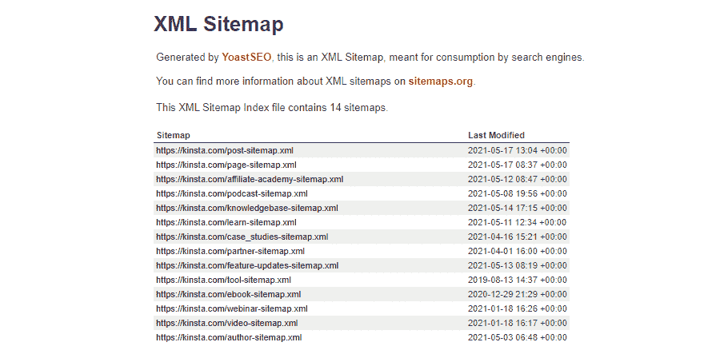
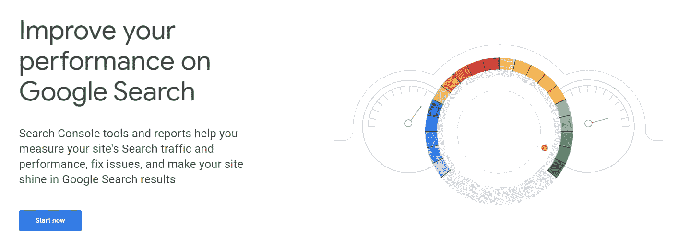
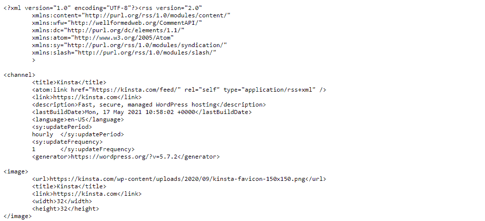
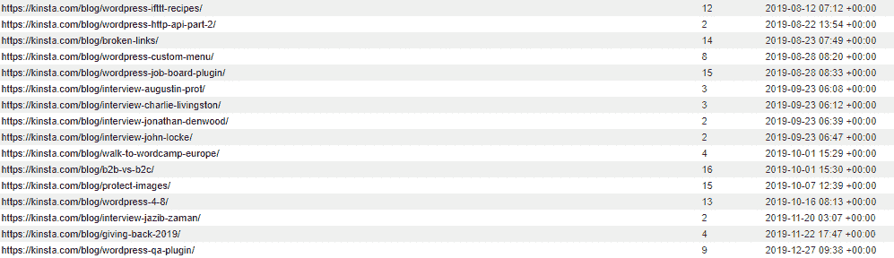
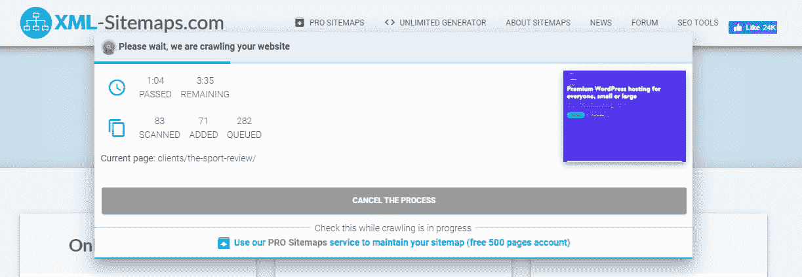
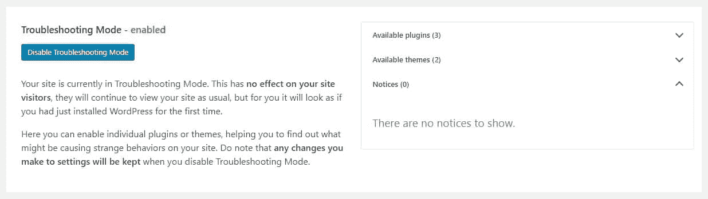

# 如何修复“你的站点地图看起来像一个 HTML 页面”的错误

> 原文：<https://kinsta.com/blog/your-sitemap-appears-to-be-an-html-page/>

WordPress 中的错误信息往往令人困惑，也很难解决，但是“你的站点地图看起来是一个 HTML 页面”的错误，谢天谢地，不在其中。

如果你遇到了这个问题，你可能想知道这个错误是什么意思，你的站点地图是 HTML 有什么问题，以及你如何确切地解决这个问题。如果你的站点地图已经是正确的格式了，你仍然看到这个错误怎么办？

我们将带你了解一切:一个[站点地图](https://kinsta.com/blog/wordpress-sitemap/)是如何工作的，它应该是什么格式，以及解决这个问题的几种不同方法。

 **查看我们的[视频指南](https://www.youtube.com/watch?v=ibUMwepfWik)修复“你的网站地图看起来像一个 HTML 页面”的错误:**

## 什么是网站地图？

你知道搜索引擎是如何找到你的网站的吗？答案是一个叫做网络爬虫的方便的小机器人——一个由搜索引擎发出的自动工具，用来索引你网站的页面。

网络上有数百万个网页，人类不可能收集每个网站的信息。网络爬虫通过互联网，在每一页和媒体上缓存信息。

> Kinsta 把我宠坏了，所以我现在要求每个供应商都提供这样的服务。我们还试图通过我们的 SaaS 工具支持达到这一水平。
> 
> <footer class="wp-block-kinsta-client-quote__footer">
> 
> 
> 
> <cite class="wp-block-kinsta-client-quote__cite">Suganthan Mohanadasan from @Suganthanmn</cite></footer>

[View plans](https://kinsta.com/plans/)

这看起来很简单，但谷歌不会自动知道你何时向网站添加新页面，比如你何时发布博客帖子或在你的商店发布新产品。他们定期发送网络爬虫访问你的站点，看看是否有什么变化，但是这个过程不是瞬间的。

当你有一个巨大的网站时，即使多次访问，爬虫也很容易错过关键页面。当这样的页面不经常被链接时，这主要是一个问题。

这就是网站地图帮助爬虫的地方。这些 XML 文件不同于您网站上的常规页面；它们通常是人类无法阅读的，也不应该被参观者看到。但是网络爬虫可以使用它们来确保所有的东西都被索引。

An example of an XML Sitemap.

他们的工作方式是简单地列出你网站上的所有页面，以及它们的链接层次，加上你网站上的其他文件，如图像和视频。它确保谷歌看到你网站上的一切，并相应地提高搜索引擎优化。

如果你使用过像谷歌分析或者谷歌搜索控制台这样的工具，那么你可能会看到一个链接到你的网站地图的选项。谷歌将参考这第一次当他们发送网络爬虫到你的站点。

The homepage of Google Search Console.

[遇到这种常见的 WordPress 错误？🤯解决方案只需点击一下鼠标😌 点击推文](https://twitter.com/intent/tweet?url=https%3A%2F%2Fkinsta.com%2Fblog%2Fyour-sitemap-appears-to-be-an-html-page%2F&via=kinsta&text=Encountering+this+common+WordPress+error%3F+%F0%9F%A4%AF+The+solution+is+just+a+click+away+%F0%9F%98%8C&hashtags=WordPressTips%2CHTML)

### HTML 和 XML 站点地图的区别

所以你的站点地图是一个 HTML 页面，但是这到底有什么问题呢？谷歌为什么要你改？

网站地图必须以特定的格式编写，以便网络爬虫理解它们。大多数时候，它需要是一个 XML 文件。他们也可以阅读 RSS、Atom、KML 或文本文件，但 XML 是最常见的选择。

An example of an RSS Feed.

XML 代表“可扩展标记语言”这是一种非常类似于 HTML 的网络语言。区别在于它的用途:虽然它是人类可读的，但它的主要功能是帮助机器编码文档和读取数据。

在这种情况下，它帮助网络爬虫理解你的站点上的页面和其他媒体在哪里，以及它们如何相互作用。

但是你可能已经在一个非常不同的上下文中见过术语“站点地图”。HTML 网站地图确实存在，但最大的区别是它们是为人类而不是为网络爬虫制作的。

如果你曾经点击过一个网站导航的链接，并在网站上发现了一个人类可读且设计美观的页面列表，这在技术上被称为站点地图。但是，虽然它可能对你的访问者有所帮助，但这不是谷歌想要的。

对于大多数用户来说，一个 XML 站点地图看起来就像一堆不可读的代码或者一堵巨大的链接墙，所以如果你想给你的站点添加一个有用的导航页面，可以随意创建一个 HTML 站点地图…但是你也必须创建一个 XML 站点地图。

A sitemap example.

### 其他类型的网站地图

当你想到一个站点地图时，脑海中浮现的可能是你站点上的一个简单的页面列表。但是谷歌使用几种不同类型的网站地图来分类各种信息。其中包括:

*   **视频:**你网站上的视频可以特别编入索引，出现在谷歌视频结果中。
*   **图片:**图片也是一样。有些图像，比如嵌入在 Javascript 代码中的图像，通常不会被索引。图片网站地图有助于确保你的网站出现在谷歌图片中。
*   **新闻:**写专栏？谷歌在其搜索中有一个专门的[谷歌新闻](https://kinsta.com/blog/submit-to-google-news/)部分，一个[新闻网站地图](https://developers.google.com/search/docs/advanced/sitemaps/news-sitemap)可以确保你在那里正确出现并获得更多流量。
*   **代码** **:** 谷歌索引代码片段，帮助程序员[搜索代码和文件](https://developers.google.com/code-search)。
*   地理数据:你可以使用一个特殊的 KML 网站地图，为谷歌提供更好的数据，显示你的企业在哪里。

通常，这些信息中的一部分在你的主站点地图中。其他人必须有专门的网站地图。最后，它们都需要用 XML 或其他支持的格式进行适当的格式化，而不是 HTML。

## 如何生成 XML 站点地图

如果您有意提交了一个指向 HTML 站点地图的链接，那么您需要用一个 XML 文件来替换它。如果你不知道如何制作，有几种不同的方法可以用你在网上找到的 WordPress 插件和生成器来制作。

即使你有一个不工作的 XML 站点地图，重新生成或提交一个不同的站点地图可能会解决这个问题。

有两种简单的方法可以获得站点地图:要么使用插件，要么用站点地图生成一个插件。

### 用插件生成网站地图

使用 WordPress，在你的网站上获得动态更新的站点地图的最简单的方法是下载一个插件。这样，您就不必手动上传任何文件到您的服务器。

有相当多的插件可以生成网站地图:

*   [**Yoast SEO**](https://wordpress.org/plugins/wordpress-seo/)**:**存储库上最流行的 SEO 插件也附带生成一个网站地图。你可以在**SEO>General>Features**和 **XML Sitemaps** 下找到设置。
*   [**rank math**](https://wordpress.org/plugins/seo-by-rank-math/)**:**这个 SEO 插件除了一个普通的站点地图，还可以生成一个 WooCommerce 站点地图和一个 KML geodata 站点地图。转到 **RankMath >网站地图设置**。
*   [**XML 站点地图**](https://wordpress.org/plugins/google-sitemap-generator/) **:** 顾名思义，XML 站点地图会生成一个站点地图。该插件是 100%免费和开源的，所以没有隐藏的费用。
*   [**XML 站点地图&谷歌新闻**](https://wordpress.org/plugins/xml-sitemap-feed/) **:** 这个插件生成一个 XML 站点地图和一个谷歌新闻站点地图。安装和设置也很容易。
*   [**配套站点地图生成器–HTML&XML**](https://wordpress.org/plugins/companion-sitemap-generator/)**:**如果你想生成一个 HTML 站点地图和一个 XML 站点地图，这就是你要的插件。两者都是自动更新的，所以你不需要做任何手工操作。

### 站点地图生成器站点

代替插件，你可以使用一个站点地图生成器，比如 [XML-Sitemaps](https://www.xml-sitemaps.com/) 或者 [XML 站点地图生成器](https://xmlsitemapgenerator.org/)。然后你可以把它上传到你的网站。

第一步:使用上面的一个网站或者你选择的任何生成器生成一个网站地图。下载 XML 文档。

XML-Sitemap Generator

## 注册订阅时事通讯

### 想知道我们是怎么让流量增长超过 1000%的吗？

加入 20，000 多名获得我们每周时事通讯和内部消息的人的行列吧！

[Subscribe Now](#newsletter)

第二步:下载 [FileZilla](https://filezilla-project.org/) 或者(如果支持的话)使用你的网络主机通过 FTP 连接到你的网站。

**步骤 3:** 将 XML 文件放入站点的根文件夹中。根目录是站点的最顶层目录，也就是您第一次连接时开始的目录。

与基于插件的网站地图不同，网站生成的网站地图不是动态的。当你在你的站点上发布新的文章和页面时，静态站点地图不会更新。你每次都需要创建一个新文件。所以对于博客和其他经常更新的网站来说，这并不理想。

## 如何修复站点地图错误

站点地图错误通常是由于意外提交了一个 HTML 页面，而不是一个格式正确的 XML 文件。但是如果你的 XML 站点地图仍然声称是一个 HTML 页面，你可能有一个更深层次的问题。

不用担心:问题通常在于你的 WordPress 插件中容易修复的冲突。这里有一些让你的站点地图再次正常工作的建议。

### 检查错误和重定向

如果您有一个明确的错误代码可以搜索，那么诊断问题会容易得多。你应该做的第一件事是访问你的站点地图页面，看看是否有奇怪的错误代码。

Kinsta’s 404 error page.

如果你在访问你的站点地图时注意到一个错误，这将导致谷歌认为它看到了一个 HTML 页面。使用此错误帮助您搜索以解决问题。我们的 HTTP 状态代码列表可能会有所帮助。

如果您间歇性地注意到站点地图错误——有时有，有时没有，该怎么办？如果你正在动态生成一个站点地图，这可能会发生。

微小的服务器信号和超时会让 Google 觉得你的站点地图突然变成了一个 HTML 页面，因为它显示的是一条错误消息而不是一个 XML 文件。只要错误是罕见的，不是持续的或频繁的，通常就不必担心。

另一件要注意的事情是重定向。如果你访问你的站点地图页面，突然出现在首页或者一个[无限重定向循环](https://kinsta.com/blog/err_too_many_redirects/)中，这也会导致东西坏掉。

如果您发现任何错误或重定向不会消失，问题通常在于插件冲突。生成站点地图的插件(如 Yoast)可能会导致冲突，或者缓存插件可能是问题的根源。

但有时，即使看似随机的插件也会引起冲突。使用[健康检查&故障排除](https://wordpress.org/plugins/health-check/)插件来识别它们。

The Health Check & Troubleshooting plugin after installation.

如果它不存在，安装它，然后转到**工具>现场健康>故障排除模式**。它会暂时关闭所有插件，而不会影响你的访客。

需要为您的新网站提供快速、可靠、安全的托管服务吗？Kinsta 提供超快的服务器和来自 WordPress 专家的 24/7 世界级支持。[查看我们的计划](https://kinsta.com/plans/?in-article-cta)

看看错误或重定向现在是否在您的网站上消失了。如果是，则逐个重新启用插件，直到站点再次崩溃。寻找多个插件之间的冲突。

您现在可以联系插件作者来报告错误并寻求帮助。

### 禁用缓存

冲突的最大原因之一是缓存插件。当一个站点地图被缓存时，有时会导致 Google 将它作为 HTML 页面读取的问题，因为你不应该以这种方式缓存 XML 文件。

因为这个原因，大多数缓存插件会避免缓存站点地图页面，但是它们可能会错误地这样做，特别是当你为你的站点地图使用一个唯一的 URL 时。

幸运的是，您不需要禁用整个缓存插件。您可以添加一个例外，问题应该会自动解决。

你的插件文档应该涵盖这一点，但这里是如何在 [WP 超级缓存](https://wordpress.org/plugins/wp-super-cache/)和 [W3 总缓存](https://wordpress.org/plugins/w3-total-cache/)中做到这一点。

对于 WP 超级缓存，进入**设置> WP 超级缓存**。在**高级**标签下，滚动到**在此添加强制页面不被缓存的字符串(不是文件名)**。

在这一部分，输入站点地图的部分 URL。例如，如果您的站点地图位于“example-site.com/sitemap.xml”，请输入“/sitemap.xml”

对于 W3 总缓存，导航到**性能>页面缓存，**然后找到**高级>从不缓存后续页面**。就像 WP 超级缓存一样，输入站点地图 URL。

你可能还想把它添加到“缩小”**性能>缩小**和**永远不要缩小后面的页面**下，因为这可能会导致问题。

### 检查您的网站地图 URL

虽然这是一个小建议，但它总是值得仔细检查:你提交了正确的链接吗？这是一个基本的错误，甚至一个不正确的字符都会指向错误的地方。

检查你提交的链接，通过谷歌和任何搜索引擎优化或网站地图插件。

一些插件可能会在站点地图页面的末尾添加一个斜杠(“example-site.com/sitemap/”而不是“example-site.com/sitemap”)。这个字符可能会导致大量问题，尤其是如果它导致重定向循环。

同样，在运行状况检查插件中打开故障排除模式，并尝试找到导致此问题的插件。大多数时候，你可以追溯到一个单独的插件。

### 移除多余的网站地图

虽然只要你链接到正确的页面通常不会引起问题，但是激活额外的站点地图偶尔会给你自己带来问题或困惑。另外，你的服务器花费了额外的资源来更新一些不必要的站点地图。

插件可能会添加不同的站点地图，你可能不知道 WordPress 甚至会为你生成自己的站点地图。您应该检查这些内容，并删除所有内容，只保留您想要使用的内容。这里有几个你可以在你的网站上试试的网址:

*   **/sitemap.xml** —大多数站点地图插件中生成站点地图的常见选择。
*   **/wp-sitemap.xml** —这是 WordPress 从 5.5 版本开始默认生成的[站点地图。](https://make.wordpress.org/core/2020/07/22/new-xml-sitemaps-functionality-in-wordpress-5-5/)
*   **/sitemap_index.xml** —由 Yoast 生成的站点地图的 URL。

如果你已经下载了其他 SEO 或 sitemap 插件，它们可能会使用完全不同的 URL。查看文档，确保禁用任何不想要的站点地图功能。

## 你真的需要一个网站地图吗？

有时候，网站地图会莫名其妙地成为一系列问题的源头。简单的修补可能不足以让它们消失。如果你经常遇到难以解决的问题，你可能会开始质疑网站地图是否对你至关重要。

创建一个网站地图通常是被鼓励的，因为谷歌自己说它不会因为这样做而惩罚你的搜索引擎优化。它只能帮助提高你的搜索引擎优化，让你的网站更快地被索引。

但是在某些情况下并不要求你有一个，谷歌自己也建议一些网站不要使用它们。

假设你的网站只有不到 500 页，并且不可能超过 500 页。在这种情况下，只要它的内部链接良好(无论如何你都应该这样做)，并且没有很多你想在谷歌图片和谷歌视频中显示的媒体文件，你可能根本不需要有一个网站地图。

另一方面，拥有一个网站地图真的可以帮助你的 SEO，而且有一个网站地图也没什么坏处，所以解决问题只会有好处。你的网站现在可能很小，但它可能不会一直很小。

如果你被卡住了，你总是可以求助于你的[主人的支持](https://kinsta.com/kinsta-support/)来找出是什么导致了这个问题。

[Wondering what exactly is wrong with your sitemap appearing as an HTML page? 🤔 This post has the answers ⬇️Click to Tweet](https://twitter.com/intent/tweet?url=https%3A%2F%2Fkinsta.com%2Fblog%2Fyour-sitemap-appears-to-be-an-html-page%2F&via=kinsta&text=Wondering+what+exactly+is+wrong+with+your+sitemap+appearing+as+an+HTML+page%3F+%F0%9F%A4%94+This+post+has+the+answers+%E2%AC%87%EF%B8%8F&hashtags=WPTips%2CHTML)

## 摘要

“sitemap 似乎是一个 HTML 页面”的错误可能是一个恼人的问题，但它通常只是一个格式不正确的页面或一个容易修复的缓存冲突的结果。一旦你发现了问题，解决它只需要几个额外的步骤。

一个错误往往会带来另一个错误，所以如果你的网站仍然有问题，试着看看我们的专栏文章 [65+ WordPress 错误](https://kinsta.com/blog/wordpress-errors/)以及如何修复它们。

* * *

让你所有的[应用程序](https://kinsta.com/application-hosting/)、[数据库](https://kinsta.com/database-hosting/)和 [WordPress 网站](https://kinsta.com/wordpress-hosting/)在线并在一个屋檐下。我们功能丰富的高性能云平台包括:

*   在 MyKinsta 仪表盘中轻松设置和管理
*   24/7 专家支持
*   最好的谷歌云平台硬件和网络，由 Kubernetes 提供最大的可扩展性
*   面向速度和安全性的企业级 Cloudflare 集成
*   全球受众覆盖全球多达 35 个数据中心和 275 多个 pop

在第一个月使用托管的[应用程序或托管](https://kinsta.com/application-hosting/)的[数据库，您可以享受 20 美元的优惠，亲自测试一下。探索我们的](https://kinsta.com/database-hosting/)[计划](https://kinsta.com/plans/)或[与销售人员交谈](https://kinsta.com/contact-us/)以找到最适合您的方式。