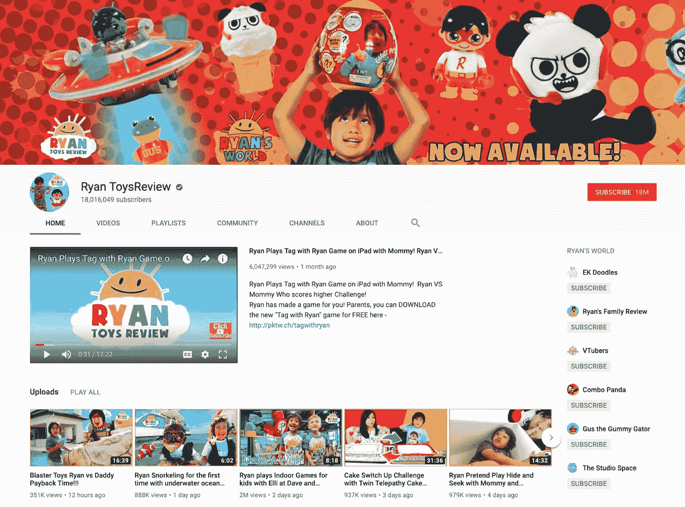
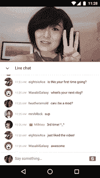
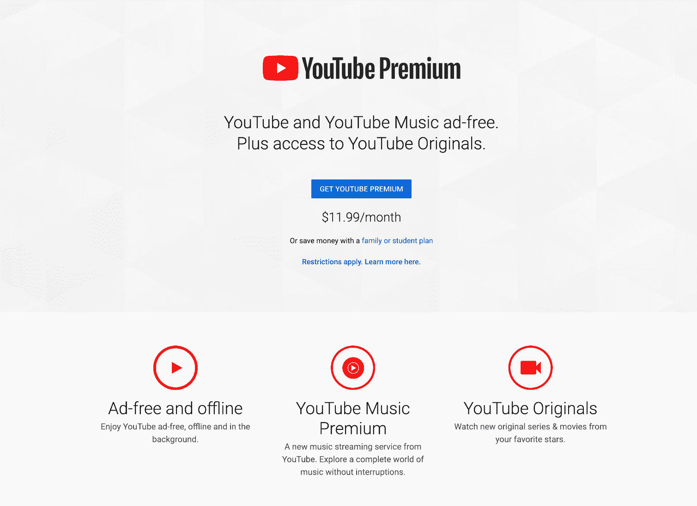
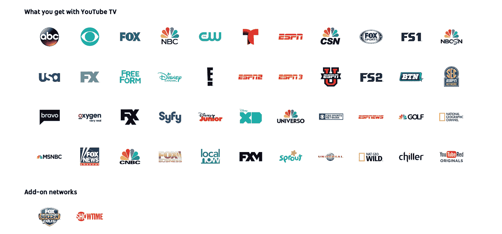
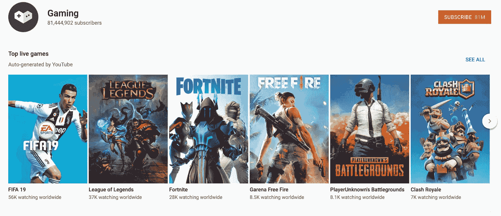

# 令人大开眼界的 YouTube 统计数据和事实(第二大访问量网站)

> 原文：<https://kinsta.com/blog/youtube-stats/>

脸书和 Instagram 等社交网站可能正在成为更好的视频平台，但我们都知道谁才是这个领域真正的 OG。根据 [Alexa 排名](https://kinsta.com/blog/alexa-rank/) , **YouTube 是世界第二大访问量网站**，仅次于拥有该平台的谷歌。

考虑到它作为一个视频分享平台的受欢迎程度——用户在这里上传、观看、评论和分享内容——你可以使用 Youtube 观看任何东西，从某个看到双彩虹的家伙到最新的 T2 妮琪·米娜音乐视频。

以下是一些最有趣和最新的 Youtube 统计数据。

[YouTube is the second most-visited site in the world! Check out some of these eye-opening stats. 📊Click to Tweet](https://twitter.com/intent/tweet?url=https%3A%2F%2Fkinsta.com%2Fblog%2Fyoutube-stats%2F&via=kinsta&text=YouTube+is+the+second+most-visited+site+in+the+world%21+Check+out+some+of+these+eye-opening+stats.+%F0%9F%93%8A&hashtags=smm%2Cvideomarketing)

## Youtube 历史统计数据

YouTube 是由查德·赫利、陈士骏和贾韦德·卡里姆创建的，他们当时都在 PayPal 工作。尽管这个团队在 2005 年 2 月 14 日晚上 9:13 获得了 www.youtube.com 的现场直播，但是直到 2005 年 4 月公众才可以上传视频。

第一个 YouTube 视频上传于 4 月 23 日。该作品由 YouTube 联合创始人卡里姆在圣地亚哥动物园创作(名为[我在动物园](https://www.youtube.com/watch?v=jNQXAC9IVRw))。这个 Youtube 创世纪的故事/视频如此受欢迎，以至于它有了自己的[维基百科页面](https://en.wikipedia.org/wiki/Me_at_the_zoo)。

2006 年 7 月，YouTube 一举成名，并迅速成为世界上发展最快的网站之一，每天有 65，000 个新视频上传，每天有 1 亿视频浏览量。
T3】

> 需要在这里大声喊出来。Kinsta 太神奇了，我用它做我的个人网站。支持是迅速和杰出的，他们的服务器是 WordPress 最快的。
> 
> <footer class="wp-block-kinsta-client-quote__footer">
> 
> 
> 
> <cite class="wp-block-kinsta-client-quote__cite">Phillip Stemann</cite></footer>

[View plans](https://kinsta.com/plans/)

## 数据挖掘 Youtube 统计

YouTube 在 100 多个国家可用，支持 80 种语言，考虑到截至 2020 年有超过 20 亿 YouTube 用户，这并不奇怪。这相当于 T2 所有互联网用户的三分之一。这些绝对是值得关注的 Youtube 统计数据！

事实证明，YouTube 用户主要是男性，占 YouTube 用户群的 62%。所有用户中的大多数最终都在 [25 至 44 岁年龄组](https://www.marketingprofs.com/chirp/2017/32835/youtube-stats-facts-and-figures-for-2017-infographic) [p](https://www.marketingprofs.com/chirp/2017/32835/youtube-stats-facts-and-figures-for-2017-infographic) 中，23%在 25 至 34 岁年龄组，26%在 35 至 44 岁年龄组。

YouTube user percentage by age (Image source: MarketingProfs)

当你把这个年龄范围再扩大一点，18 到 49 岁的人，结果是这个年龄组中有 80%的人在某个月观看 YouTube。

仅在手机上，YouTube [接触到的 18 至 49 岁人群](https://www.thinkwithgoogle.com/consumer-insights/video-trends-where-audience-watching/)就比有线电视多。
T3】

## YouTube 用户是做什么的？

YouTube 用户大多在做你期望他们做的事情，观看大量视频内容，上传大量视频内容。

每分钟有超过 500 个小时的视频被上传到 YouTube 上，每天有超过 10 亿个小时的视频被观看。超过一半的观看量[来自移动设备](https://www.youtube.com/yt/about/press/)，用户[每天花超过一个小时](https://youtube.googleblog.com/2017/06/updates-from-vidcon-more-users-more.html)在他们的移动设备上观看 YouTube 视频。2018 年是 YouTube 观众人数在过去两年中增长最快的一年，人们观看 YouTube 视频的时间同比增长了 60%。

YouTube statistics (Image source: YouTube)

2011 年，据估计，Youtube 的浏览量仅来自于 30%的视频，这意味着这个社交媒体巨头依靠精选的少数内容制作者来驱动绝大多数的流量。然而，这一发现似乎并没有阻止普通 YouTube 用户上传内容。
T3】

## YouTube 金融事实

2006 年，当科技巨头以 16.5 亿美元收购视频内容平台时，YouTube 成为谷歌的第二大收购。当时，价格标签令人瞠目结舌，不少分析师都认为谷歌进行收购是疯狂的。当然，直到[脸书](https://kinsta.com/blog/facebook-marketing/)在[采取行动，以](https://kinsta.com/blog/instagram-stats/)[相似的价格](https://techcrunch.com/2018/06/20/instagram-1-billion-users/)收购 Instagram 。

正如 2016 年林格写的那样，

> 然而，十年后，收购 YouTube 被广泛认为是有史以来最好的消费科技收购之一。

尽管 2016 年美银美林对 YouTube 的估值为 700 亿美元或更多，但该公司的利润水平仍存在不确定性。马哈尼去年在一份研究报告中写道，

> Alphabet 没有透露 YouTube 赚了多少钱，但加拿大皇家银行资本(RBC Capital)分析师马克·马哈尼(Mark Mahaney)估计，YouTube 的年收入已达到 100 亿美元，并以每年 40%的速度增长。这种增长使 YouTube 成为当今互联网上最强大的资产之一。

YouTube 面临的问题是，由于内容版税、巨大的带宽、存储和处理成本，它的运营成本很高。

众所周知，YouTube 对侵犯版权的行为非常严厉，经常会删除违反版权法的视频(比如 [DMCA 侵权](https://legalbeagle.com/8335872-consequences-dmca-violation.html)使用未经许可的音乐)。为了支持知识产权，自 2007 年以来，YouTube】已经向版权所有者支付了 20 亿美元。

## YouTube 上的广告

YouTube 上的第一批广告于 2007 年 8 月推出。然而，在广告收入方面，YouTube 对其数据守口如瓶。尽管如此，一位商业分析师估计，YouTube 将在 2018 年为 T2 赚取 150 亿美元的广告收入。另据估计， **YouTube 约占谷歌广告收入的 6%。**

## YouTube 迎合内容创作者

许多人声称 Snapchat 没有对他们的影响者给予足够的关注，与此不同，YouTube 非常注重与内容创作者及其粉丝的关系。他们明白少数内容创作者在驱动大多数观点，所以他们尽最大努力照顾这样的创作者。

这些 Youtube 统计数据深入挖掘了该平台最受欢迎的创作者:

一个这样的内容创作者是视频游戏评论员 PewDiePie，他在 YouTube 上拥有最多的用户，大约有 6470 万。你可能很熟悉他的名字，因为他是最近一场[争议的中心](https://www.businessinsider.com/pewdiepie-anti-semitism-jokes-controversy-explained-2017-2)，这场争议导致 Youtube 在联合制作内容方面切断了与他的联系——但并没有切断 PewDiePie 从他的频道获得广告收入的渠道。

另一个有争议的 Youtube 明星是[罗根·保罗](https://www.youtube.com/channel/UCG8rbF3g2AMX70yOd8vqIZg)，她在日本臭名昭著的青木原自杀森林与一具尸体分享视频后失宠。尽管 Youtube 公开反对他，并承诺将承担严重后果，但罗根·保罗仍然活跃在该平台上，[从他的视频中获得广告收入](https://www.engadget.com/2018/02/27/youtube-restores-logan-paul-ad-revenue/)。

诸如此类的情况引发了一个问题，即 Youtube 是否是平台上创作者行为的同谋，继续让他们将他们公开分享的任何东西货币化——但这是另一篇文章的讨论内容。

继续，收入最高的 YouTuber 也是一名视频游戏评论员，是丹·米德尔顿( [DanTDM](http://www.youtube.com/user/TheDiamondMinecart) )，他在 2017 年赚了 1650 万美元。由于他在 YouTuber 上的成功，他进行了一次世界巡演，其中包括在悉尼歌剧院的四个门票售罄的夜晚。而且，他不是这个房子里唯一一个认真对待电子游戏的人。他的妻子是 [JemPlaysMC](https://www.youtube.com/channel/UCWhXpAZF5tA7AnFah33kbdw) ，一个受欢迎的 YouTube《我的世界》评论员。

现在，如果你的年龄足够大，可以阅读这篇文章，并且你没有七位数的工资，你可能会想跳过 YouTube 的下一个统计数据，因为它会引发嫉妒:最年轻的 YouTube 明星是 6 岁的瑞安·托伊斯雷维，他在 2017 年赚了 1100 万美元。

Ryan Toys Review

尽管有很多 YouTube 明星赚了数百万美元，但内容也是由美国约 9%的小企业制作的，成功程度各不相同。不出所料，大公司也在 YouTube 上制作大量内容。事实上，Youtube 最受欢迎的品牌频道是 [LEGO](https://www.youtube.com/user/LEGO) ，拥有超过 78 亿次观看和 500 万订户。

Youtube 也是一个了解更多 WordPress 的好地方！

### YouTube 内容创作者的盈利机会

自 2017 年以来，YouTube 上年收入五位数的内容创作者数量[增长了 35%](https://youtube.googleblog.com/2018/06/vidcon-2018-helping-creators-earn-more.html) ，年收入六位数的增加了 40%——其中大部分收入来自广告。

YouTube 最近帮助其顶级内容创作者从他们的频道和视频中赚钱的一个方法是引入一个名为[超级聊天](https://support.google.com/youtube/answer/7277005?hl=en)的功能。该功能允许粉丝购买将在实时聊天会话中脱颖而出的消息。

Super Chat

除此之外，YouTube 还通过许多不同的方式扩大了盈利机会:

## 注册订阅时事通讯

### 想知道我们是怎么让流量增长超过 1000%的吗？

加入 20，000 多名获得我们每周时事通讯和内部消息的人的行列吧！

[Subscribe Now](#newsletter)

*   [票务](https://support.google.com/youtube/answer/7570245?hl=en)允许艺术家在他们的视频观看页面上展示即将到来的美国音乐会。这项功能是通过与 Ticketmaster 的合作实现的，它也将显示在离 YouTube 用户最近的节目列表的顶部。
*   商品是优酷赚钱的另一种方式。作为 YouTube 合作伙伴计划的一部分，内容创作者可以链接到众筹和商品分销网站。
*   频道会员资格，以前被称为赞助，当观众成为该频道的会员时，他们可以获得某些额外津贴和特权。
*   [BrandConnect](https://support.google.com/youtube/answer/9385307) 是 YouTube 的品牌内容平台，将 YouTube 内容创作者和品牌聚集在一起。在数据的驱动下，该平台将品牌与最合适的创作者联系起来，这样双方都可以满足他们的目标。

## YouTube 成长:新闻和新功能

随着在线内容趋向于视频，YouTube 站在新视频概念的前沿并迅速适应竞争对手也就不足为奇了。

看看这些关于 Youtube 增长的统计数据:

### YouTube 虚拟现实

YouTube 在 2016 年推出了 YouTube VR 应用，此前推出了 Daydream View 耳机。YouTube VR 提供了你所期待的:它展示了最新的 VR 视频。

YouTube 随后在 HTC Vive 和 PlayStation VR 上推出了 VR。截至【2018 年 7 月，YouTube VR 也可以配合三星 Gear VR 头戴设备使用。

### YouTube 故事

YouTube 故事是由 Snapchat、[、Instagram](https://kinsta.com/blog/wordpress-instagram-plugin/) 和脸书推广的[视频内容](https://kinsta.com/blog/visual-content-strategy/)平台上流行的短暂内容。[社区](https://youtube-creators.googleblog.com/2017/11/expanding-community-on-youtube.html)(拥有超过 10，000 名订阅者的用户)可以获得故事，可以从 YouTube 用户的订阅源顶部、创作者的故事选项卡或主页观看。

因为 YouTube Stories 仍处于测试阶段，所以对于内容创作者来说有很大的灵活性，他们可以决定他们是否希望这些故事保持 24 小时可见，或者直到他们决定删除它们。目前，YouTube 用户也只能通过 YouTube 应用程序[观看故事](https://support.google.com/youtube/answer/7573166?hl=en)。

### YouTube 首映

随着[首映](https://www.youtube.com/watch?v=43o_pBtrIYw)，内容创作者可以上传预先录制的视频作为现场时刻。然后，YouTube 将自动创建一个公共登录页面，以建立对内容的预期和宣传。

当首映视频内容正在播放时，将会有一个实时聊天，以便粉丝能够相互聊天以及与内容创建者聊天。该功能还允许收入流，如通过超级聊天和频道会员创建的收入流，这在以前只允许直播视频。

## 使用 YouTube Premium 为 YouTube 付费

YouTube Premium ，前身是 YouTube Red，允许用户在没有广告的情况下访问 YouTube。YouTube 高级用户还可以访问 YouTube 音乐、YouTube 的音乐流媒体服务和 YouTube 原创音乐。

Struggling with downtime and WordPress problems? Kinsta is the hosting solution designed to save you time! [Check out our features](https://kinsta.com/features/)

YouTube Premium

除了避免广告之外，YouTube Premium 的主要优势之一是它允许 YouTube 用户在后台播放视频，即使他们正在打开另一个应用程序。它还允许 YouTube 用户在数据不足或离线时下载视频。

YouTube Premium 于 2018 年 6 月推出，在 [17 个国家](https://youtube.googleblog.com/2018/06/youtube-music-and-youtube-premium.html)提供。前三个月免费，之后单个用户每月需支付 11.99 美元的订阅费。还有一个家庭计划，售价 17.99 美元。

## YouTube OG

[YouTube Originals](https://www.youtube.com/channel/UCqVDpXKLmKeBU_yyt_QkItQ/about) ，前身是 YouTube Red Originals，是一个托管 YouTube 原创内容的频道，主要由 YouTube 现有的超级明星创建(并围绕他们构建)。

虽然不像网飞、Hulu 或亚马逊 Prime Video 的原创节目库那样广泛，但 YouTube Originals 也有一些早期粉丝的最爱，比如 Cobra Kai，这就像是《空手道小子》系列电影的电视剧衍生品；《步步高升》:一部基于《步步高升》系列电影的连续剧；以及由约翰·塞纳和凯特·戴琳斯配音的成人动画片《达拉斯和机器人》。

## 通过 YouTube 电视观看全部内容

[YouTube TV](https://tv.youtube.com/) ，是[于 2017 年 2 月](https://youtube.googleblog.com/2017/02/finally-live-tv-made-for-you.html)推出的，是为了应对观众不断变化的需求而产生的。观众希望在旅途中观看电视节目(而不仅仅是在电视机上),并且不希望在 DVR 中塞满录像。

YouTube TV 共有 40 个频道，用户可以从 ABC、CBS、FOX、NBC、ESPN、地区体育网络和其他几十个流行的有线电视网络(如 USA、Disney Channel、Bravo 和 E！。这些频道可以在电视、智能手机、平板电脑和电脑上观看。

YouTube TV channels

YouTube TV 还允许用户访问基于云的 DVR，没有存储限制，允许 YouTube 用户保存节目长达 9 个月。

六个账户的订阅费起价为 40 美元，每个账户都有自己独特的推荐和云存储。但是，用户一次最多只能观看三个并发流。

迄今为止，YouTube 电视仅在美国部分城市可用。

## 用 YouTube 游戏砸按钮

因为大多数最受欢迎和收入最高的 YouTube 用户都是游戏玩家或游戏评论员，所以当 YouTube Gaming 在 2015 年推出时并不奇怪。

YouTube Gaming 是一个独立的 YouTube 页面,专注于游戏社区和文化，将 YouTube 用户与来自世界各地的游戏和玩家联系起来。

YouTube Gaming

每个游戏(如《我的世界》)都有自己的页面，上面有直播流，以及专注于该游戏的视频和内容创作者。游戏频道超过 25000 个！

## 听 YouTube 音乐

YouTube Music 让 YouTube 用户几乎可以获得他们想要的任何音乐:官方专辑、现场表演、混音、翻唱和大量难以找到的音乐。它还有数千个播放列表，并提供音乐推荐。

虽然 YouTube Music 是 YouTube Premium 包的一部分，但它也可以作为一个独立的产品购买，每月 9.99 美元。其他国家的 Google Play 音乐订阅用户将可以通过当前订阅获得 YouTube 音乐，只要该音乐在他们的国家可用。也就是说，Google Play 音乐没有任何变化。

你想知道为什么人们会为 YouTube 音乐付费吗？是因为 [95%最受关注的](https://en.wikipedia.org/wiki/List_of_most-viewed_YouTube_videos)视频都是音乐视频。事实上，YouTube 上点击率最高的视频是[路易斯·丰西(Luis Fonsi)的《](https://www.youtube.com/watch?v=kJQP7kiw5Fk)[【Despacito】](https://www.youtube.com/watch?v=kJQP7kiw5Fk)》，点击率为 53 亿次，而且还在增加。

“Despacito”花了 97 天达到 10 亿次点击量，但这还不是最快的。阿黛尔以她的[音乐视频《你好》](https://www.youtube.com/watch?v=YQHsXMglC9A)保持着这一纪录，该视频仅用了 [87 天就达到了 10 亿次点击量](https://www.statista.com/statistics/733295/fastest-viral-videos-to-reach-1-billion-views/)。

就连最不喜欢的 YouTube 视频也是音乐视频。这个不太讨人喜欢的记录是由[贾斯汀比伯为“宝贝”](https://www.youtube.com/watch?v=kffacxfA7G4)制作的音乐视频促成的，该视频有超过 920 万人不喜欢。

## 摘要

尽管 YouTube 的盈利能力被秘密掩盖，但从 YouTube 的统计数据来看，这个视频平台显然是市场上的主导力量。毫无疑问，这其中很大一部分来自于该公司开发和多样化其产品的积极举措，因为它迎合了通过在线视频成为百万富翁的内容创作者。

如此庞大的公司托管着如此多奇异、成功和独特的内容，必然会有更有趣的 YouTube 统计数据。

你注意到你最喜欢的 YouTube 事实不见了吗？在下面的评论区添加吧！

* * *

让你所有的[应用程序](https://kinsta.com/application-hosting/)、[数据库](https://kinsta.com/database-hosting/)和 [WordPress 网站](https://kinsta.com/wordpress-hosting/)在线并在一个屋檐下。我们功能丰富的高性能云平台包括:

*   在 MyKinsta 仪表盘中轻松设置和管理
*   24/7 专家支持
*   最好的谷歌云平台硬件和网络，由 Kubernetes 提供最大的可扩展性
*   面向速度和安全性的企业级 Cloudflare 集成
*   全球受众覆盖全球多达 35 个数据中心和 275 多个 pop

在第一个月使用托管的[应用程序或托管](https://kinsta.com/application-hosting/)的[数据库，您可以享受 20 美元的优惠，亲自测试一下。探索我们的](https://kinsta.com/database-hosting/)[计划](https://kinsta.com/plans/)或[与销售人员交谈](https://kinsta.com/contact-us/)以找到最适合您的方式。